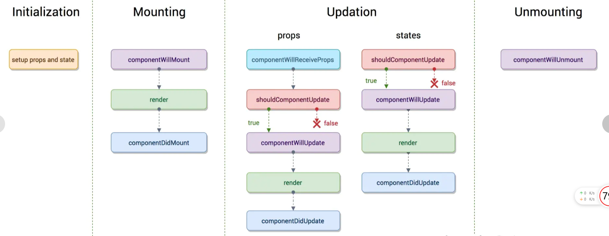

## 创建React APP

```
npx create-react-app my-app
cd my-app
npm start
```

## 整体生态区别（与VUE）

Vue生態：

```
Vue+Vue-Router+Vuex+Axios+Babel+Webpack
```

React生態：

```
React+React-Router-Redux+Axios+Babel+Webpack
```

## React生命週期介紹

- **getDefaultProps**

  通過這個方法，來初始化一個Props屬性，Props就來自於父組件

- **getInitialState**

  初始化state，可以直接在constructor中定義this.state

- **componentwillMount**

  組件加載時只調用，以後組件更新不調用，整個生命週期只調用一次，此時可以修改state

- **render**

  是一個React組件必須定義的生命週期，用來渲染dom，是使用最多，最重要的放方法

- **componetDidMount**

  組件渲染之後調用，只調用一次

- **componentwillReceiveProps**

  組件加載時不調用，組件接受新的props時調用

- **shouldComponentUpdate**

  組件接收新的props或者state時調用

- **componentwillUpdate**

  在組件接收新的props或者state但還沒有render時被調用，在初始化時不會被調用

- **componentDidUpdate**

  組件完成更新後立即調用，在初始化時不會被調用

- **componentWillUnmount**

  在組件從DOM中移除之前立刻被調用



可参考[react生命周期](https://www.jianshu.com/p/514fe21b9914)

## Redux基本介紹

**單項數據流：**

從父組件流向子組件，兄弟組件無法共享數據

**state：**

React中的狀態，是隻讀對象，不可直接修改

**Reducer：**

基本函數，用於對state的業務處理

**Action：**

普通對象，用於描述事件行為，改變state

## 参考资料

https://codertw.com/%E7%A8%8B%E5%BC%8F%E8%AA%9E%E8%A8%80/661270/#outline__2

