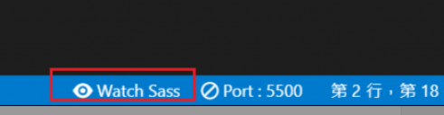

## 基本了解

SASS是成熟，稳定，强大的 **CSS预处理器** ，而 **SCSS** 是SASS3版本当中引入的新语法特性，完全兼容CSS3的同时继承了CSS强大的动态功能。(官网说了很多..um...总之**SCSS 是 Sass 的其中一种语法规则而已，即 SCSS 是 Sass 的子集**)

之前的笔记也写过另外一个css预处理器 -Less - [看这里](https://savancode.github.io/2020/11/14/Less/)

## 安装

### 基于webpack (Vue)

如果是在 vue-cli 项目中，可以使用以下命令安装

```sh
npm install node-sass --save-dev
npm install sass-loader --save-dev
或者
yarn add sass-loader node-sass --dev
```

vue-cli生成的项目，已经默认加入了处理sass的loader
只需要在需要的地方加入`lang=scss`即可

```
<style lang='scss' scope>
...
</style>
```

### 是基于webpack

按照[官网教程](https://sass-lang.com/install)，手动把 `scss` 编译成 `css` 文件，然后自己引入。

## 确认版本

```sh
$ sass -v
```

## 文件生成

在屏幕上显示.scss文件转化的css代码。（假设文件名为test。）

```bash
sass test.scss
```

如果要将显示结果保存成文件，后面再跟一个.css文件名。

```bash
sass test.scss test.css
```

## SASS监听文件/目录

生产环境当中，一般使用最后一个选项。

```bash
sass --style compressed test.sass test.css
```

你也可以让SASS监听某个文件或目录，一旦源文件有变动，就自动生成编译后的版本 - 监听 `app/sass` 目录下所有文件的变动，并 编译 CSS 到 `public/stylesheets` 目录下。

```bash
// watch a file
sass --watch input.scss:output.css
// watch a directory
sass --watch app/sass:public/stylesheets
```

## 语法

### 变量- **$**

```scss
// _variables.scss
$basic-font-size: 16px;
$primary-color:#fa0;

// layout.scss
body{
    font-size:$basic-font-size;
}

// layout.css
body {
  font-size: 16px;
}
```

### 计算

```scss
div {
    margin: 12px * 2;
    top: 50px + 100px;
    right: $var * 10%;
}

article[role="main"] {
  float: left;
  width: 600px / 960px * 100%;
}

aside[role="complementary"] {
  float: right;
  width: 300px / 960px * 100%;
}
```

### 条件判断 if else

```scss
@if lightness($color) > 30% {
　　background-color: #000;
} @else {
　　background-color: #fff;
}
```

#### 进阶会变成

```scss
//SCSS
@mixin blockOrHidden($boolean:true) {
  @if $boolean {
    @debug "$boolean is #{$boolean}";
    display: block;
  }
  @else {
      @debug "$boolean is #{$boolean}";
      display: none;
   }
}
.block {
  @include blockOrHidden;
}
.hidden{
  @include blockOrHidden(false);
}
```

```css
/*编译后*/
.block {
  display: block;
}
.hidden {
  display: none;
}    
```

## `#{}` 插值

### 遍历写法 for

#### 基本语法

```
@for $i from <start> through <end>
@for $i from <start> to <end>
```

#### 简单例子

##### through

```scss
// 生成 .f12 {font-size: 12px} .... .f30 {font-size: 30px}
@for $i from 12 through 30 {
  .f_#{$i} {
    font-size: #{$i}px;
  }
}

@each $member in a, b, c, d {
　　.#{$member} {
　　　　background-image: url("/image/#{$member}.jpg");
　　}
}
// 在列表里面用下标取数据
$colors: #7FA0FF, #98BDFF, #A1D2B6, #FFDB46, #FFB63E, #F77C7A, #696CC9, #787EF3;
@for $i from 1 through 8 {
  .label:nth-child(#{$i}):before {
      background: nth($pieColors, $i);
  }
}
```

##### to

```scss
@for $i from 1 to 3 {
  .item-#{$i} { width: 2em * $i; }
}
/*编译后*/
.item-1 {
  width: 2em;
}
.item-2 {
  width: 4em;
}
```

### 嵌套 `{}`

```scss
div {
　　h1 {
　　　　color:red;
　　}
}
//属性也可嵌套(用的较少)
div {
　　border: {
　　　　color: red;
　　}
}
//在嵌套的代码块内，可以使用&引用父元素。比如a:hover伪类，可以写成：
a {
　　&:hover { color: #f00; }
}
```

## @while循环

```scss
//SCSS
$types: 4;
$type-width: 20px;
@while $types > 0 {
    .while-#{$types} {
        width: $type-width + $types;
    }
    $types: $types - 1;
}
```

```css
.while-4 {
  width: 24px;
}
.while-3 {
  width: 23px;
}
.while-2 {
  width: 22px;
}
.while-1 {
  width: 21px;
}
```

## @each循环

### 基本语法

```dart
@each $var in <list>
```

### 基本例子

```scss
$list: a b c d e;/*$list 就是一个列表*/
@mixin author-images {
    @each $author in $list {
        .photo-#{$author} {
            background: url("/images/avatars/#{$author}.png") no-repeat;
        }
    }
}
.author-bio {
    @include author-images;
}
```

```css
.author-bio .photo-a {
  background: url("/images/avatars/a.png") no-repeat; }
.author-bio .photo-b {
  background: url("/images/avatars/b.png") no-repeat; }
.author-bio .photo-c {
  background: url("/images/avatars/c.png") no-repeat; }
.author-bio .photo-d {
  background: url("/images/avatars/d.png") no-repeat; }
.author-bio .photo-e {
  background: url("/images/avatars/e.png") no-repeat; }
```

## import  引入-@import

```scss
@import "reset"; // 重設css
@import "variables"; // 所有變數都存放於此
@import "mixins"; // 所有mixin相關的scss

// 本地文件
@import "filepath";
// 第三方文件
@import url("file's url")
```

### extend  继承- @extend

有很多 css 样式需要复用，就可以用继承，语法是 @extend，可以在继承的 css 前加入 **%** 符號，只有被继承的 css 会被编译，原 extend 语法不會被编译，% 表佔位符，所以套用 %继承的样式位置在文件中會往前提升， 继承同一個 css 的 class，编译出的內容会放在一起。

```scss
.super {
    color: red;
}
.sub {
    @extend .super;
    font-size: 12px;
}
```

```scss
%clearfix{ // 用%(佔位符)不會被scss编译 class的(.)不用写 但@extend时也要加上% 
    &:after{
        content: '';
        display: table;
        clear: both;
    }
}

// 垂直居中
%vertical-center{
    position: relative;
    top:50%; // 外层空間向下移50%
    transform: translateY(-50%);//内层空間往上移50%
}

%_d-b{
    display: block;
}

.box{
    @extend %clearfix; // class的(.)不用写
}

._rwdimg{
    @extend %_d-b;
    max-width:100%;
    height:auto;
    margin:0 auto;
}
```

#### 辅助extend的!optional

如果故意 extend 不存在的样式名称，则会编译出错， 加上「!optional」修饰词，以表示当 extend 不存在样式名称时候，就不会做 render。

```scss
.notice {
    color: blue;
    font-weight: bold;
    font-size: 2em;
}

.important {
    @extend .notice2 !optional;
}
```

####  @extend in @media

在 @media 范围里面使用  @extend 呼叫指定样式名称时候，该样式名称不能放在 @media 范围之外，否则会出错， 应该把样式名称放在 @media 范围里面才行。

```scss
// layout.scss
@media screen and (max-width:960px){
    // 用 % 版本會出錯 因為本身不會被編譯
    //  %vertical-center{
    //     position: relative;
    //     top:50%;
    //     transform: translateY(-50%);/
    // }
    .vertical-center{
        position: relative;
        top:50%; 
        transform: translateY(-50%);
    }
    .box{
        @extend .vertical-center;
    }
}

// layout.css
@media screen and (max-width: 960px) {
  .vertical-center, .box {
    position: relative;
    top: 50%;
    -webkit-transform: translateY(-50%);
            transform: translateY(-50%);
  }
}
```

### 内置函数

```scss
// 如颜色的
lighten(#cc3, 10%) // #d6d65c
darken(#cc3, 10%) // #a3a329
grayscale(#cc3) // #808080
complement(#cc3) // #33c
```

### 字符串函数-unquote()函数

- unquote($string)：删除字符串中的引号；

- quote($string)：给字符串添加引号。

**unquote( ) 函数只能删除字符串最前和最后的引号（双引号或单引号），而无法删除字符串中间的引号。如果字符没有带引号，返回的将是字符串本身**

**使用 quote() 函数只能给字符串增加双引号，而且字符串中间有单引号或者空格时，需要用单引号或双引号括起，否则编译的时候将会报错。**

```scss
.test {
    content: unquote("'Hello Sass!");
}
.test {
    content: unquote("'Hello Sass!'");
}
.test {
    content: unquote('"Hello Sass!"');
//编译
.test {
    content: unquote('Hello Sass!);
}
.test {
    content: unquote('Hello Sass!');
}
.test {
    content: unquote("Hello Sass!");
 }
```

```scss
.test {
    content: quote(ImWebDesigner);
}
.test {
    content: quote(' ');
}
//编译
.test {
    content: quote("ImWebDesigner");
}
.test {
    content: quote(" ");
}
```

### 字符串函数-To-upper-case()、To-lower-case()

### 数字函数-percentage()

```scss
width : percentage(.2) // width : 20%
```

### 数字函数-round()函数 ceil()函数 floor()函数 abs()函数

```scss
 width:round(12.3px)// width: 12px;
 width:ceil(12.3px);//13px
 width:floor(12.3px);//12px
 width:abs(-12.3px);//12.3px
```
### 数字函数-min()函数、max()函数 random()函数
**单位注意要一样的！！！！！**
```scss
>> min(1,2,1%,3,300%)
1%
>> max(1,5)
5
```

### 自定义函数- @function

```scss
// _variables.scss
$basic-font-size:16px;
$primary-color:#fa0;

// _function.scss 或是 _mixins.scss
@function toRem($px){
    @return ($px / basic-font-size) * 1rem;
}

// layout.scss
@import "helpers/variables";
@import "mixins/mixins";

h1{
    font-size : toRem(32px); 
}
.btn{
    background-color: $primary-color;
    &:hover{
        background-color: darken($primary-color, 15%); 
    }
}
s
//layout.css
h1{
    font-size : 2rem;// 转换单位px->rem
}
.btn {
    background-color: #fa0;
}
.btn:hover {
    background-color: #b37700; // hover颜色加深15%
}
```


### 混用 (Mixin) -@mixin

混用-总是混的( ╯□╰ )

> **Mixin 跟 extend 最大的不同** →
> Mixin 是产生多个样式；extend 是将样式全部集中管理。

```scss
// _mixins.scss
@mixin svg-icon($icon, $width, $height){
    background: url("images/#{$icon}.png");
    background:none, url("images/#{$icon}.svg");
    // ie8以下不支持 會跑上面的，新浏览器都可以支持高像素的svg
    width: $width;
    height: $height;
}

// _layout.scss
.icon-youtube{
    @include svg-icon('icon',120px,120px)
}

// _layout.css
.icon-youtube {
    background: url("images/icon.png");
    background: none, url("images/icon.svg");
    width: 120px;
    height: 120px;
}
```

#### 搭配 media

```scss
// mixins.scss
// content
@mixin mobile{
    @media screen and (max-width:767px) {
        @content;
    }
}

// layout.scss
.container{
    @include mobile{
        background: #fff;
    }
}

//layout.css
@media screen and (max-width: 767px) {
    .container {
        background: #fff;
    }
}
```

## 推荐工具

vscode 中 [Live Sass Compiler](https://github.com/ritwickdey/vscode-live-sass-compiler)

!!写完scss 直接回生成css 但是记得点击右下方的**watch**!!!



## Vue scss 踩坑

 这里实践写的是 vue+element的admin

### 报错 TypeError

```
 Syntax Error: TypeError: this.getOptions is not a function
 
 @ ./node_modules/vue-style-loader??ref--8-oneOf-1-0!./node_modules/css-loader/dist/cjs.js??ref--8-oneOf-1-1!./node_modules/vue-loader-v16/dist/stylePostLoader.js!./node_modules/postcss-loader/src??ref--8-oneOf-1-2!./node_modules/sass-loader/dist/cjs.js??ref--8-oneOf-1-3!./node_modules/cache-loader/dist/cjs.js??ref--0-0!./node_modules/vue-loader-v16/dist??ref--0-1!./src/App.vue?vue&type=style&index=0&id=7ba5bd90&lang=scss 4:14-419 14:3-18:5 15:22-427
 @ ./src/App.vue?vue&type=style&index=0&id=7ba5bd90&lang=scss
 @ ./src/App.vue
 @ ./src/main.js
```

**yarn add sass-loader@^10.1.1** 

### 报错 TypeError

```
TypeError [ERR_INVALID_ARG_TYPE]: The "path" argument must be of type string.
```

### 报错   UnhandledPromiseRejectionWarning

```
UnhandledPromiseRejectionWarning: Unhandled promise rejection. This error originated either by throwing inside of an async function without a catch block, or by rejecting a promise which was not handled with .catch(). To terminate the node process on unhandled promise rejection, use the CLI flag `--unhandled-rejections=strict`
```

版本问题！！！这真的是 /(ㄒoㄒ)/~~ （下面是7.3.1 练习的时候用的是7.3.0）

```sh
npm install sass-loader@7.3.1 --save-dev
npm install --save-dev node-sass
```


### 报错 sass-loader@11.0.1" has incorrect peer dependency "webpack@^5.0.0".

Similar to what @KostDM said, in my case it seems like sass-loader@11.0.0 doesn't work with vue@2.6.12.

I installed sass-loader@10.1.1 and it worked like a charm again.

解决: yarn add sass-loader@^10.1.1

[来源](https://stackoverflow.com/questions/66082397/typeerror-this-getoptions-is-not-a-function)

### [报错  Node Sass version 5.0.0 is incompatible with ^4.0.0.](https://stackoverflow.com/questions/64625050/error-node-sass-version-5-0-0-is-incompatible-with-4-0-0)

```
Node Sass version 5.0.0 is incompatible with ^4.0.0.
```

1. `npm uninstall node-sass`
2. `npm install node-sass@4.14.1`

Or, if using yarn (default in newer CRA versions)

1. `yarn remove node-sass`
2. `yarn add node-sass@4.14.1`

### 报错 Cannot find module 'node-sass'

```
Module build failed: Error: Cannot find module 'node-sass'
```

**npm install node-sass**

## [vue使用scss，并且全局引入公共scss样式](https://www.cnblogs.com/juewuzhe/p/11840816.html)

## Reference

[sass的官方文档](https://www.sasscss.com/documentation)

[Sass Basics](https://www.sasscss.com/guide)

[sass W3School](https://www.w3schools.com/sass/)