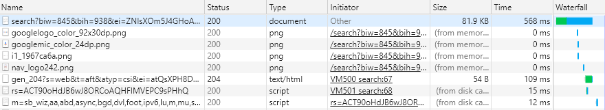
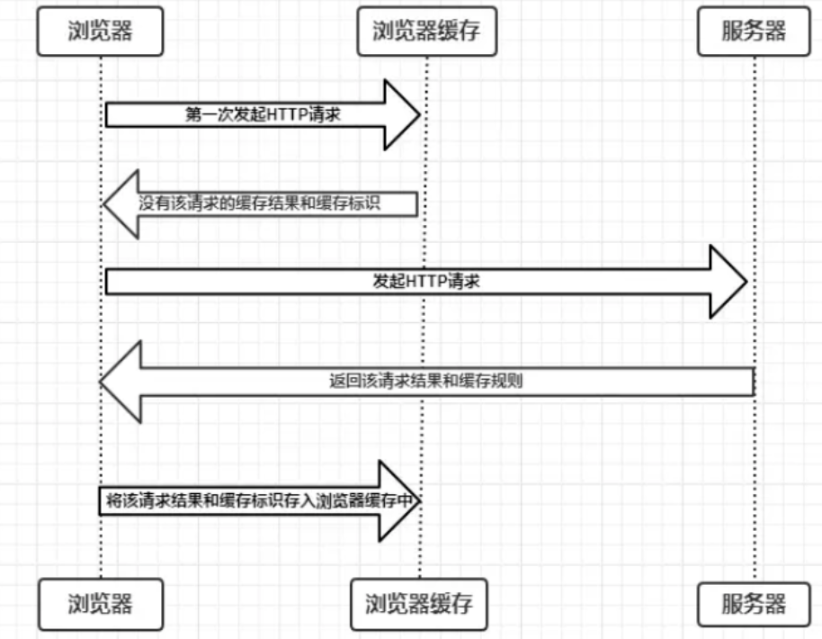
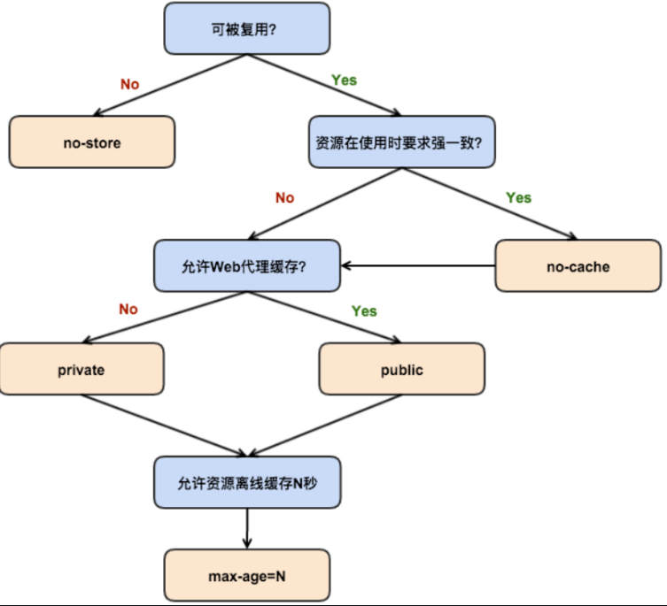
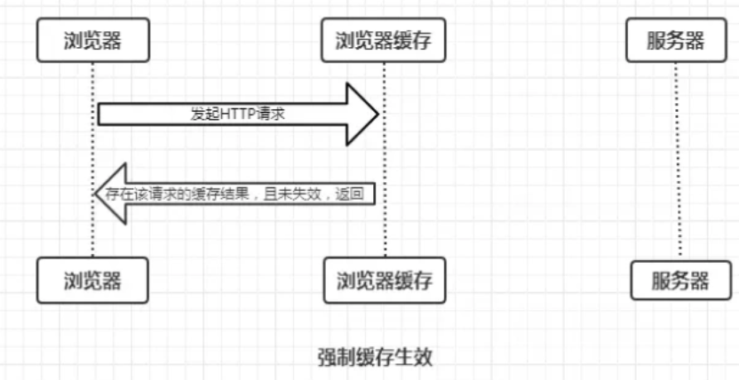
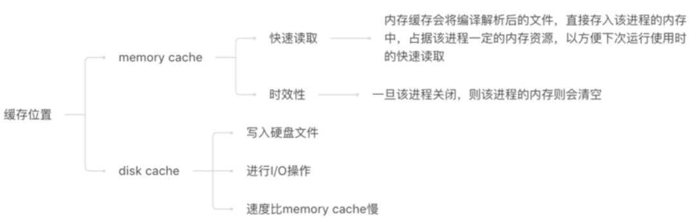
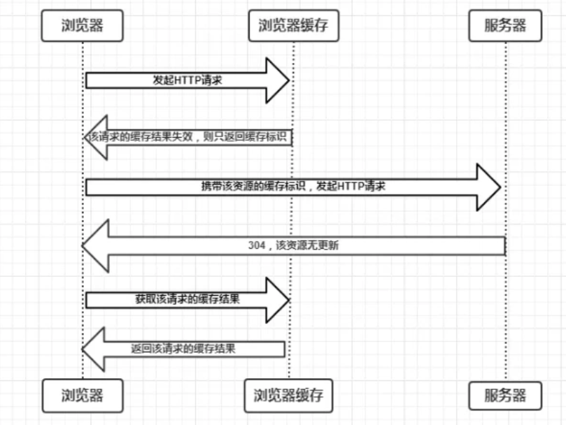
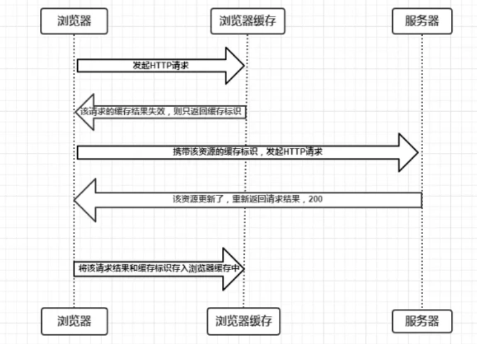

> 缓存，这是一个老生常谈的话题，也常被作为前端面试的一个知识点
>
> 其实宏观的讲 缓存在宏观上可以分成两类：**私有缓存和共享缓存**； 微观上： **浏览器缓存** **代理服务器缓存**  **网关缓存** **数据库缓存**

## 浏览器缓存为什么重要

一个优秀的缓存策略可以

- **缓解服务器压力**
- 缩短网页请求资源的距离，**提升性能**
- 由于缓存文件可以重复利用，减少带宽，**降低网络负荷**。

**对于一个数据请求来说，可以分为发起网络请求、后端处理、浏览器响应三个步骤。**浏览器缓存可以帮助我们在第一和第三步骤中优化性能。比如说直接使用缓存而不发起请求，或者发起了请求但后端存储的数据和前端一致，那么就没有必要再将数据回传回来，这样就减少了响应数据。


[本图来源](https://github.com/ljianshu/Blog/issues/23)


## 缓存位置（小细节 可以看了就过）

从缓存位置上来说分为四种，并且各自有优先级，当依次查找缓存且都没有命中的时候，才会去请求网络。

- Service Worker
- Memory Cache
- Disk Cache
- Push Cache

### 1.Service Worker

Service Worker 是运行在浏览器背后的独立线程，一般可以用来实现缓存功能。使用 Service Worker的话，传输协议必须为 HTTPS。因为 Service Worker 中涉及到请求拦截，所以必须使用 HTTPS 协议来保障安全。**Service Worker 的缓存与浏览器其他内建的缓存机制不同，它可以让我们自由控制缓存哪些文件、如何匹配缓存、如何读取缓存，并且缓存是持续性的**。

Service Worker 实现缓存功能一般分为三个步骤：首先需要先注册 Service Worker，然后监听到 install 事件以后就可以缓存需要的文件，那么在下次用户访问的时候就可以通过拦截请求的方式查询是否存在缓存，存在缓存的话就可以直接读取缓存文件，否则就去请求数据。

当 Service Worker 没有命中缓存的时候，我们需要去调用 fetch 函数获取数据。也就是说，如果我们没有在 Service Worker 命中缓存的话，会根据缓存查找优先级去查找数据。但是不管我们是从 Memory Cache 中还是从网络请求中获取的数据，浏览器都会显示我们是从 Service Worker 中获取的内容。

### 2.Memory Cache

Memory Cache 也就是内存中的缓存，主要包含的是当前中页面中已经抓取到的资源,例如页面上已经下载的样式、脚本、图片等。读取内存中的数据肯定比磁盘快,内存缓存虽然读取高效，可是缓存持续性很短，会随着进程的释放而释放。 **一旦我们关闭 Tab 页面，内存中的缓存也就被释放了**。

**那么既然内存缓存这么高效，我们是不是能让数据都存放在内存中呢？**
这是不可能的。计算机中的内存一定比硬盘容量小得多，操作系统需要精打细算内存的使用，所以能让我们使用的内存必然不多。

当我们访问过页面以后，再次刷新页面，可以发现很多数据都来自于内存缓存



内存缓存中有一块重要的缓存资源是preloader相关指令（例如`<link rel="prefetch">`）下载的资源。总所周知preloader的相关指令已经是页面优化的常见手段之一，它可以一边解析js/css文件，一边网络请求下一个资源。

需要注意的事情是，**内存缓存在缓存资源时并不关心返回资源的HTTP缓存头Cache-Control是什么值，同时资源的匹配也并非仅仅是对URL做匹配，还可能会对Content-Type，CORS等其他特征做校验**。

### 3.Disk Cache

Disk Cache 也就是存储在硬盘中的缓存，读取速度慢点，但是什么都能存储到磁盘中，**比之 Memory Cache 胜在容量和存储时效性上**。

在所有浏览器缓存中，Disk Cache 覆盖面基本是最大的。它会根据 HTTP Herder 中的字段判断哪些资源需要缓存，哪些资源可以不请求直接使用，哪些资源已经过期需要重新请求。并且即使在跨站点的情况下，相同地址的资源一旦被硬盘缓存下来，就不会再次去请求数据。绝大部分的缓存都来自 Disk Cache，关于 HTTP 的协议头中的缓存字段，我们会在下文进行详细介绍。

**浏览器会把哪些文件丢进内存中？哪些丢进硬盘中？**
关于这点，网上说法不一，不过以下观点比较靠得住：

- 对于大文件来说，大概率是不存储在内存中的，反之优先
- 当前系统内存使用率高的话，文件优先存储进硬盘

### 4.Push Cache

Push Cache（推送缓存）是 HTTP/2 中的内容，当以上三种缓存都没有命中时，它才会被使用。**它只在会话（Session）中存在，一旦会话结束就被释放，并且缓存时间也很短暂**，在Chrome浏览器中只有5分钟左右，同时它也并非严格执行HTTP头中的缓存指令。

Push Cache 在国内能够查到的资料很少，也是因为 HTTP/2 在国内不够普及。这里推荐阅读`Jake Archibald`的 [HTTP/2 push is tougher than I thought](https://jakearchibald.com/2017/h2-push-tougher-than-i-thought/) 这篇文章，文章中的几个结论：

- 所有的资源都能被推送，并且能够被缓存,但是 Edge 和 Safari 浏览器支持相对比较差
- 可以推送 no-cache 和 no-store 的资源
- 一旦连接被关闭，Push Cache 就被释放
- 多个页面可以使用同一个HTTP/2的连接，也就可以使用同一个Push Cache。这主要还是依赖浏览器的实现而定，出于对性能的考虑，有的浏览器会对相同域名但不同的tab标签使用同一个HTTP连接。
- Push Cache 中的缓存只能被使用一次
- 浏览器可以拒绝接受已经存在的资源推送
- 你可以给其他域名推送资源

如果以上四种缓存都没有命中的话，那么只能发起请求来获取资源了。

那么为了性能上的考虑，大部分的接口都应该选择好缓存策略，**通常浏览器缓存策略分为两种：强缓存和协商缓存，并且缓存策略都是通过设置 HTTP Header 来实现的**。

## 浏览器怎么确定一个资源该不该缓存

**根据第一次请求资源时返回的HTTP Header**

```bash
Age:23146
Cache-Control:max-age=2592000 //有效时间
Date:Tue, 28 Nov 2017 12:26:41 GMT
ETag:W/"5a1cf09a-63c6" //资源唯一标识
Expires:Thu, 28 Dec 2017 05:27:45 GMT //到期的绝对时间
Last-Modified:Tue, 28 Nov 2017 05:14:02 GMT //请求时最后修改时间
Vary:Accept-Encoding //IE缓存，允许压缩

If-Modified-Since : Fri , 12 May 2006 18:53:33 GMT
//当浏览器第二次请求这个URL的时候，根据HTTP协议规定，浏览器会把第一次Last-Modified的值存储在If-Modified-Since里面发送给服务端来验证资源有没有修改 验证本地缓存是否可用
If-None-Match: abc-123456
//If-None-Match优先级更高 比If-Modified-Since
//当浏览器第二次请求这个URL的时候，根据HTTP协议规定，浏览器回把第一次ETag的值存储在If-None-Match里面发送给服务端来验证资源有没有修改 验证返回304 200
```

我们来看看怎么第一次拿到的

## 初次发起HTTP请求时，缓存的过程



> 这里后面的拓展
>
> 如果是直接从缓存结果没有有缓存标识，走协商缓存
> 存在该缓存结果和缓存标识，且该结果尚未失效，强制缓存生效，直接返回该结果（强缓存）

- 浏览器每次发起请求，都会先在浏览器缓存中查找该请求的结果以及缓存标识
- 浏览器每次拿到返回的请求结果都会将该结果和缓存标识存入浏览器缓存中

以上两点结论就是浏览器缓存机制的关键。

## 完整的缓存机制

1. 浏览器发送请求前，根据请求头的expires和cache-control判断是否命中（包括是否过期）强缓存策略，如果命中，直接从缓存获取资源，并不会发送请求。如果没有命中，则进入下一步。 
2. 没有命中强缓存规则，浏览器会发送请求，根据请求头的last-modified和etag判断是否命中协商缓存，如果命中，直接从缓存获取资源。如果没有命中，则进入下一步。 
3. 如果前两步都没有命中，则直接从服务端获取资源。


## 缓存过程 - 强制缓存

### 强缓存定义

强缓存：不会向服务器发送请求，直接从缓存中读取资源

### 强缓存依据 - Expires Cache-Control

强缓存可以通过设置两种 HTTP Header 实现：Expires 和 Cache-Control（级别更高）。

> Expires（HTTP/1.0） ： 指定资源到期的时间
>
> Cache-Control（HTTP/1.1）优先~~~：
>
> - public：所有内容都将被缓存（客户端和代理服务器都可缓存）
> - private：所有内容只有客户端可以缓存，`Cache-Control`的默认取值
> - no-cache：客户端缓存内容，但是是否使用缓存则需要经过**协商缓存**来验证决定
> - no-store：所有内容都不会被缓存，即不使用强制缓存，也不使用协商缓存
> - max-age=30：缓存内容将在30秒后失效



### 强制缓存过程

存在该缓存结果和缓存标识，且该结果尚未失效，强制缓存生效，直接返回该结果



### 缓存位置

内存缓存(from memory cache)和硬盘缓存(from disk cache)，如下:

- **内存缓存(from memory cache)**：内存缓存具有两个特点，分别是**快速读取**和**时效性**：
  - **快速读取**：内存缓存会将编译解析后的文件，直接存入该进程的内存中，占据该进程一定的内存资源，以方便下次运行使用时的快速读取。
  - **时效性**：一旦该进程关闭，则该进程的内存则会清空。
- **硬盘缓存(from disk cache)**：硬盘缓存则是直接将缓存写入硬盘文件中，读取缓存需要对该缓存存放的硬盘文件进行I/O操作，然后重新解析该缓存内容，读取复杂，速度比内存缓存慢。

在浏览器中，浏览器会在js和图片等文件解析执行后直接存入内存缓存中，那么当刷新页面时只需直接从内存缓存中读取(from memory cache)；而css文件则会存入硬盘文件中，所以每次渲染页面都需要从硬盘读取缓存(from disk cache)。



## 缓存过程 - 协商缓存

### 协商缓存定义

协商缓存就是强制缓存失效后，浏览器携带缓存标识向服务器发起请求，由服务器根据缓存标识决定是否使用缓存的过程

### 协商缓存依据

#### Last-Modified和If-Modified-Since

浏览器下一次请求这个资源，浏览器检测到有 Last-Modified这个header，于是添加If-Modified-Since这个header，值就是Last-Modified中的值；服务器再次收到这个资源请求，会根据 If-Modified-Since 中的值与服务器中这个资源的最后修改时间对比，

- 如果没有变化，返回304和空的响应体，直接从缓存读取，

- 如果If-Modified-Since的时间小于服务器中这个资源的最后修改时间，说明文件有更新，于是返回新的资源文件和200

#### 弊端

  - 如果本地打开缓存文件，即使没有对文件进行修改，但还是会造成 Last-Modified 被修改，服务端不能命中缓存导致发送相同的资源
  - 因为 Last-Modified 只能以秒计时，如果在不可感知的时间内修改完成文件，那么服务端会认为资源还是命中了，不会返回正确的资源

#### ETag和If-None-Match（优先级高）

**Etag是服务器响应请求时，返回当前资源文件的一个唯一标识(由服务器生成)，只要资源有变化，Etag就会重新生成**。浏览器在下一次加载资源向服务器发送请求时，会将上一次返回的Etag值放到request header里的If-None-Match里，服务器只需要比较客户端传来的If-None-Match跟自己服务器上该资源的ETag是否一致，就能很好地判断资源相对客户端而言是否被修改过了。

- 如果服务器发现ETag匹配不上，那么直接以常规GET 200回包形式将新的资源（当然也包括了新的ETag）发给客户端；

- 如果ETag是一致的，则直接返回304知会客户端直接使用本地缓存即可。

### 两者之间对比

- 首先在精确度上，Etag要优于Last-Modified。

Last-Modified的时间单位是秒，如果某个文件在1秒内改变了多次，那么他们的Last-Modified其实并没有体现出来修改，但是Etag每次都会改变确保了精度；如果是负载均衡的服务器，各个服务器生成的Last-Modified也有可能不一致。

- 第二在性能上，Etag要逊于Last-Modified，毕竟Last-Modified只需要记录时间，而Etag需要服务器通过算法来计算出一个hash值。
- 第三在优先级上，服务器校验优先考虑Etag

### 协商缓存过程

协商缓存就是强制缓存失效后，浏览器携带缓存标识向服务器发起请求，由服务器根据缓存标识决定是否使用缓存的过程，主要有以下两种情况：

- 协商缓存生效，返回304和Not Modified

  

- 协商缓存失效，返回200和请求结果

  

## 如果什么缓存策略都没设置，那么浏览器会怎么处理？

对于这种情况，浏览器会采用一个启发式的算法，通常会取响应头中的 Date 减去 Last-Modified 值的 10% 作为缓存时间。

## 实际场景应用缓存策略

### 1.频繁变动的资源

> Cache-Control: no-cache

对于频繁变动的资源，首先需要使用`Cache-Control: no-cache` 使浏览器每次都请求服务器，然后配合 ETag 或者 Last-Modified 来验证资源是否有效。这样的做法虽然不能节省请求数量，但是能显著减少响应数据大小。

### 2.不常变化的资源

> Cache-Control: max-age=31536000

通常在处理这类资源时，给它们的 Cache-Control 配置一个很大的 `max-age=31536000` (一年)，这样浏览器之后请求相同的 URL 会命中强制缓存。而为了解决更新的问题，就需要在文件名(或者路径)中添加 hash， 版本号等动态字符，之后更改动态字符，从而达到更改引用 URL 的目的，让之前的强制缓存失效 (其实并未立即失效，只是不再使用了而已)。
在线提供的类库 (如 `jquery-3.3.1.min.js`, `lodash.min.js` 等) 均采用这个模式。

## 用户行为对浏览器缓存的影响

所谓用户行为对浏览器缓存的影响，指的就是用户在浏览器如何操作时，会触发怎样的缓存策略。主要有 3 种：

- 打开网页，地址栏输入地址： 查找 disk cache 中是否有匹配。如有则使用；如没有则发送网络请求。
- 普通刷新 (F5)：因为 TAB 并没有关闭，因此 memory cache 是可用的，会被优先使用(如果匹配的话)。其次才是 disk cache。
- 强制刷新 (Ctrl + F5)：浏览器不使用缓存，因此发送的请求头部均带有 `Cache-control: no-cache`(为了兼容，还带了 `Pragma: no-cache`),服务器直接返回 200 和最新内容。

 **问题：请求被缓存，导致新代码未生效**

- 服务端响应添加`Cache-Control:no-cache,must-revalidate`指令；
- 修改请求头`If-modified-since:0`或`If-none-match`；
- 修改请求URL，请求URL后加随机数，随机数可以是时间戳，哈希值，比如：[http://damonare.cn?a=1234](https://link.zhihu.com/?target=http%3A//damonare.cn/%3Fa%3D1234)

**问题：服务端缓存导致本地代码未更新**

- 合理设置Cache-Control:s-maxage指令；
- 设置Cache-Control:private指令，防止代理服务器缓存资源；
- CDN缓存可以使用管理员设置的缓存刷新接口进行刷新；

**问题： Cache-Control: max-age=0 和 no-cache有什么不同**

`max-age=0`和`no-cache`应该是从语气上不同。`max-age=0`是告诉客户端资源的缓存到期**应该**向服务器验证缓存的有效性。而`no-cache`则告诉客户端使用缓存前**必须**向服务器验证缓存的有效性。


## Reference

[深入理解浏览器的缓存机制](https://github.com/ljianshu/Blog/issues/23) 

[浏览器缓存](https://github.com/xiangxingchen/blog/issues/9)

[缓存详解](https://zhuanlan.zhihu.com/p/33356918)

[彻底理解浏览器的缓存机制](https://heyingye.github.io/2018/04/16/%E5%BD%BB%E5%BA%95%E7%90%86%E8%A7%A3%E6%B5%8F%E8%A7%88%E5%99%A8%E7%9A%84%E7%BC%93%E5%AD%98%E6%9C%BA%E5%88%B6/)