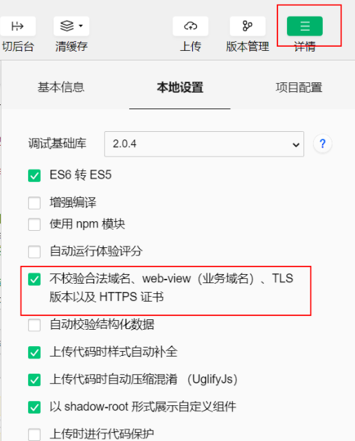

## 将数据对象转化为json格式

传输

```js
url: '../index/index?massIfo='+JSON.stringify(res.data)
```
在接收次数据页面：
```js
JSON.parse(options.massIfo)
```

## **传递基本数据类型** - 直接绑在url上

 index.js 发送页JS

```javascript
Page({
  data: {
    testStr: '字符串str'
  },
  onLoad: function () {
  },
  next: function(e){
    wx.navigateTo({
      url: '/pages/test/test?str='+this.data.testStr,
    })
  }
})
```

 test.js 接受页JS

```javascript
Page({
  data:{
  },
  onLoad:function(options){
    console.log("接收到的参数是str="+options.str);
  }
})
```

## **传递对象{}**

 **index.js 发送页JS**

```javascript
Page({ 
  data: {
    testData:{name:'我是name', extra:'我是extra'} 
  },
  onLoad: function () {
  },
  next: function(e){
    wx.navigateTo({
      url: '/pages/test/test?extra='+JSON.stringify(this.data.testData)
    })
  }
})
```

**test.js 接受页JS**

```javascript
Page({
  data:{
	testData:null
  },  onLoad:function(options){    
	console.log("接收到的参数是obj="+options.extra);//此处打印出来的仅仅是字符串 需要解析，解析如下
	this.dat.testData = JSON.parse(options.extra);//解析得到对象
  }})
```

## **传递数组集合[]**

 **index.js 发送页JS**
```javascript
Page({
  data: {
    list:['item-A','item-B']
  },
  onLoad: function () {
  
  },
  next: function(e){
    wx.navigateTo({
      url: '/pages/test/test?list='+JSON.stringify(this.data.list),
    })
  }
})
```
 **test.js 接受页JS**
```javascript
Page({ 
  data:{
	list:[] 
  },   
	onLoad:function(options){     
	console.log("接收到的参数是list="+options.list);//此处打印出来的是字符串，解析如下    	 
 	this.data.list = JSON.parse(options.list);//解析得到集合 
 }})
```


## 使用全局变量

```js
//app.js
App({
    globalData:{
        foo:'bar'
    }
})
```

```js
//page.js
var app=getApp()
var getFoo=app.globalData.foo
app.globalData.foo='fun'
```

## 通过缓存(wx.setStorage(OBJECT)，wx.setStorageSync(KEY,DATA))来传递数据

文档 https://www.w3cschool.cn/weixinapp/weixinapp-apidate.html

*只是保存后需要清除，防止缓存过大的情况.*

1. 同步缓存：wx.setStorageSync(key, value)
2. 异步缓存：wx.setStorage(Object object)
3. 同步删除缓存：wx.removeStorageSync(key)
4. 异步删除缓存：wx.removeStorage(Object object)
5. 同步获取缓存： wx.getStorageSync(key)
6. 异步获取缓存： wx.getStorage(key)
7. 同步查询缓存： wx.getStorageInfoSync(string key)
8. 异步查询缓存： wx.getStorageInfo(Object object)
9. 同步清空缓存：wx.clearStorageSync()
10. 异步清空缓存：wx.clearStorage(Object object)

```js
Page({  
    data: {    
    	name:["张三","李四","王五","重八"]  
    },  
    onLoad: function (options) {    
    	/*同步缓存数据*/    
    	wx.setStorageSync("name", this.data.name)    
    	/*同步获取数据*/ 
    	let data1 = wx.getStorageSync('name')    
    	console.log(data1)  
    }, 
})
```


## 个人练习

newteo

公开的api

新闻列表 https://unidemo.dcloud.net.cn/api/news
（单个新闻 url: 'https://unidemo.dcloud.net.cn/api/news/36kr/'+ post_id,）

## 容易出现错误

由于大多数为免费api

所以注意如果有这个

```
https://unidemo.dcloud.net.cn 不在以下 request 合法域名列表中，请参考文档：https://developers.weixin.qq.com/miniprogram/dev/framework/ability/network.html
```

注意做下面的

