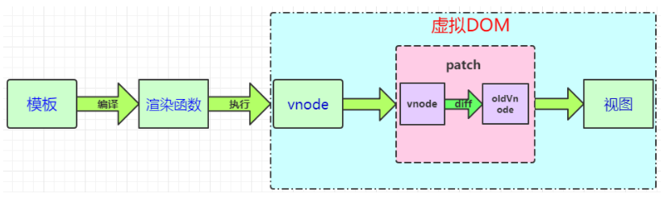
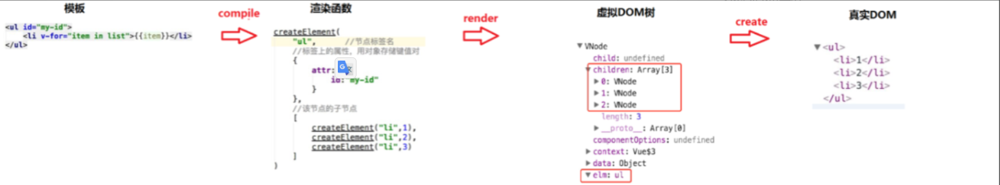
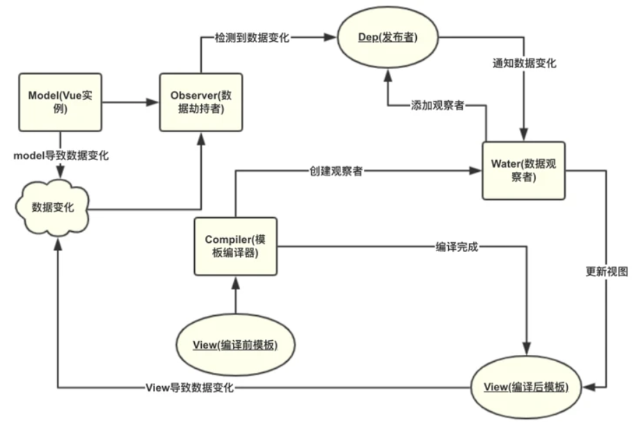
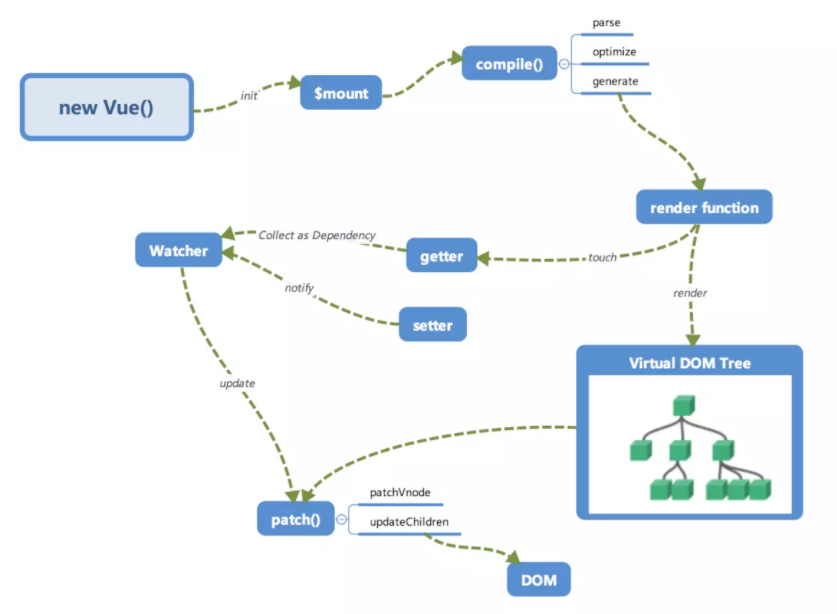
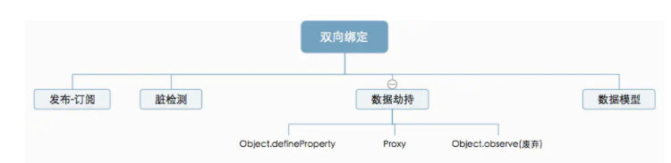

[参考的主要内容](https://juejin.cn/post/6886266739378618382)

### 虚拟DOM

虚拟 dom 本质是Object对象，VNode 是对真实 DOM 的一种抽象描述

Virtual DOM 理解为一个简单的JS对象，并且最少包含标签名( tag)、属性(attrs)和子元素对象( children)三个属性。不同的框架对这三个属性的命名会有点差别。

Vue 通过建立一个**虚拟 DOM** 来追踪自己要如何改变真实 DOM。请仔细看这行代码：

```
return createElement('h1', this.blogTitle)
```

`createElement` 到底会返回什么呢？其实不是一个*实际的* DOM 元素。它更准确的名字可能是 `createNodeDescription`，因为它所包含的信息会告诉 Vue 页面上需要渲染什么样的节点，包括及其子节点的描述信息。我们把这样的节点描述为“虚拟节点 (virtual node)”，也常简写它为“**VNode**”。“虚拟 DOM”是我们对由 Vue 组件树建立起来的整个 VNode 树的称呼。





> 1.Vue.js通过编译将template 模板转换成渲染函数(render ) ，执行渲染函数就可以得到一个虚拟节点树
>
> 2.VNode 虚拟节点：它可以代表一个真实的 dom 节点。通过 createElement 方法能将 VNode 渲染成 dom 节点。简单地说，vnode可以理解成节点描述对象，它描述了应该怎样去创建真实的DOM节点。
>
> 3.patch(也叫做patching算法)：虚拟DOM最核心的部分，它可以将vnode渲染成真实的DOM，这个过程是对比新旧虚拟节点之间有哪些不同，然后根据对比结果找出需要更新的的节点进行更新。这点我们从单词含义就可以看出， patch本身就有补丁、修补的意思，其实际作用是在现有DOM上进行修改来实现更新视图的目的。Vue的Virtual DOM Patching算法是基于[Snabbdom](https://github.com/snabbdom/snabbdom)的实现，并在些基础上作了很多的调整和改进。

**Virtual DOM到真实的dom需要经过以下过程：VNode 的 create、diff、patch**

虚拟dom 的诞生， 是我们可以不直接操作DOM：只想操作数据便可以重新渲染页面， 而隐藏在背后的原理便是高效的diff 算法，它的核心基于两个简单的假设：

1： 两个相同的组件产生类似DOM结构， 不同的组件产生不同的DOM 结构；

2： 同一层级的一组节点， 他们可以通过唯一的id 进行区分

#### 虚拟DOM作用（提高效率优化性能）

- 提供与真实DOM节点所对应的虚拟节点vnode
- 将虚拟节点vnode和旧虚拟节点oldVnode进行对比（diff算法），然后更新视图

### Diff 策略

逻辑性的解释！！！ 注意

**diff的策略是什么？有什么根据？**

**答：**
 1、Web UI 中 DOM 节点跨层级的移动操作特别少，可以忽略不计，因此仅进行同层比较。
 2、如果父节点不同，放弃对子节点的比较，直接删除旧节点然后添加新的节点重新渲染；
 3、如果子节点有变化，Virtual DOM不会计算变化的是什么，而是重新渲染。
 4、同级多个节点可通过唯一的key对比异同；

**diff流程是什么？**

**答：**
新旧节点不同：创建新节点 ➜ 更新父占位符节点 ➜ 删除旧节点；
新旧节点相同且没有子节点：不变；
新旧节点相同且都有子节点：遍历子节点同级比较，做移动、添加、删除三个操作

#### [Diff实现过程](https://www.infoq.cn/article/hucO1IFCg757j2lDr7OT?utm_source=related_read_bottom&utm_medium=article)

### NextTick()

含义：在下次 DOM 更新循环结束之后执行延迟回调。在修改数据之后立即使用这个方法，获取更新后的 DOM

所以就有了这个**获取更新后的DOM的Vue方法**（也就是**当数据更新了，在dom中渲染后，自动执行该函数，**）
```jsx
<template>
  <div class="hello">
    <div>
      <button id="firstBtn" @click="testClick()" ref="aa">{{testMsg}}</button>
    </div>
  </div>
</template>

<script>
export default {
  name: 'HelloWorld',
  data () {
    return {
      testMsg:"原始值",
    }
  },
  methods:{
    testClick:function(){
      let that=this;
      that.testMsg="修改后的值";
      console.log(that.$refs.aa.innerText);   //that.$refs.aa获取指定DOM，输出：原始值
    }
  }
}
</script>
```
使用this.$nextTick()
```js
  methods:{
    testClick:function(){
      let that=this;
      that.testMsg="修改后的值";
      that.$nextTick(function(){
        console.log(that.$refs.aa.innerText);  //输出：修改后的值
      });
    }
  }
```
注意：Vue 实现响应式并不是数据发生变化之后 DOM 立即变化，而是按一定的策略进行 DOM 的更新。$nextTick 是在下次 DOM 更新循环结束之后执行延迟回调，在修改数据之后使用 $nextTick，则可以在回调中获取更新后的 DOM，

#### 什么时候需要用的Vue.nextTick()？？

1、Vue生命周期的created()钩子函数进行的DOM操作一定要放在Vue.nextTick()的回调函数中，原因是在created()钩子函数执行的时候DOM 其实并未进行任何渲染，而此时进行DOM操作无异于徒劳，所以此处一定要将DOM操作的js代码放进Vue.nextTick()的回调函数中。与之对应的就是mounted钩子函数，因为该钩子函数执行时所有的DOM挂载已完成。

```js
  created(){
    let that=this;
    that.$nextTick(function(){  //不使用this.$nextTick()方法会报错
        that.$refs.aa.innerHTML="created中更改了按钮内容";  //写入到DOM元素
    });
  },
```

2、当项目中你想在改变DOM元素的数据后基于新的dom做点什么，对新DOM一系列的js操作都需要放进Vue.nextTick()的回调函数中；通俗的理解是：更改数据后当你想立即使用js操作新的视图的时候需要使用它
```jsx
<template>
  <div class="hello">
    <h3 id="h">{{testMsg}}</h3>
  </div>
</template>

<script>
export default {
  name: 'HelloWorld',
  data () {
    return {
      testMsg:"原始值",
    }
  },
  methods:{
    changeTxt:function(){
      let that=this;
      that.testMsg="修改后的文本值";  //vue数据改变，改变dom结构
      let domTxt=document.getElementById('h').innerText;  //后续js对dom的操作
      console.log(domTxt);  //输出可以看到vue数据修改后DOM并没有立即更新，后续的dom都不是最新的
      if(domTxt==="原始值"){
        console.log("文本data被修改后dom内容没立即更新");
      }else {
        console.log("文本data被修改后dom内容被马上更新了");
      }
    },

  }
}
</script>
```
正确的用法是：vue改变dom元素结构后使用vue.$nextTick()方法来实现dom数据更新后延迟执行后续代码

```js
changeTxt:function(){
  let that=this;
  that.testMsg="修改后的文本值";  //修改dom结构
   
  that.$nextTick(function(){  //使用vue.$nextTick()方法可以dom数据更新后延迟执行
    let domTxt=document.getElementById('h').innerText; 
    console.log(domTxt);  //输出可以看到vue数据修改后并没有DOM没有立即更新，
    if(domTxt==="原始值"){
      console.log("文本data被修改后dom内容没立即更新");
    }else {
      console.log("文本data被修改后dom内容被马上更新了");
    }
  });
}
```
#### **Vue.nextTick(callback) 使用原理：**

[官方](https://cn.vuejs.org/v2/api/index.html#Vue-nextTick)

根本原因是，**Vue是异步执行dom更新的，**一旦观察到数据变化，Vue就会开启一个队列，然后把在同一个事件循环 (event loop) 当中观察到数据变化的 watcher 推送进这个队列。如果这个watcher被触发多次，只会被推送到队列一次。这种缓冲行为可以有效的去掉重复数据造成的不必要的计算和DOm操作。而在下一个事件循环时，Vue会清空队列，并进行必要的DOM更新。
当你设置 vm.someData = 'new value'，DOM 并不会马上更新，而是在异步队列被清除，也就是下一个事件循环开始时执行更新时才会进行必要的DOM更新。如果此时你想要根据更新的 DOM 状态去做某些事情，就会出现问题。为了在数据变化之后等待 Vue 完成更新 DOM ，可以在数据变化之后立即使用 Vue.nextTick(callback) 。这样回调函数在 DOM 更新完成后就会调用。 


注意：

mounted vs updated vs nexttick区别？

> **把this.$nextTick放在created里面和mounted里面有什么区别吗？**
>
> 对组件本身来说没区别。非说有有区别的话也就是你要两个里面都写 `$nextTick`，`created` 里那个会比 `mounted` 里的先触发。
>
> 同步子组件，写 `created` + `$nextTick` 和写 `mounted` 都行；异步子组件，除非是在父组件中直接操作异步子组件的生命周期钩子、或者子组件通过 `$emit` 的方式通知父组件，否则单纯靠父组件自己，是无法百分百保证的。

- `created`: 可以正常访问数据，此时还没渲染
- `mounted`: 组件初始化完成，可以访问dom
- `$nextTick`: 每次数据更新之后，渲染完毕的回调，如果没有渲染完毕，新增的或使用了`v-if`的`dom`通过`this.$refs.xxx`无法获取到

需要操做`DOM`的，放在`this.$nextTick`里；
不需要的，`created`、`mounted`看你自己喜欢；

[阅读源码](https://juejin.cn/post/6844903695935602696#heading-0)

### [Vue数据双向绑定原理和实现](https://segmentfault.com/a/1190000021327394)

Vue实现数据双向绑定主要利用的就是: **数据劫持**和**发布订阅模式**。
所谓发布订阅模式就是，定义了对象间的一种**一对多的关系**，**让多个观察者对象同时监听某一个主题对象，当一个对象发生改变时，所有依赖于它的对象都将得到通知**。
所谓数据劫持，就是**利用JavaScript的访问器属性**，即**Object.defineProperty()方法**，当对对象的属性进行赋值时，Object.defineProperty就可以**通过set方法劫持到数据的变化**，然后**通知发布者(主题对象)去通知所有观察者**，观察者收到通知后，就会对视图进行更新。





## watch与computed的区别

**computed:**

- computed是计算属性,也就是计算值,它更多用于计算值的场景
- computed具有缓存性,computed的值在getter执行后是会缓存的，只有在它依赖的属性值改变之后，下一次获取computed的值时才会重新调用对应的getter来计算 computed适用于计算比较消耗性能的计算场景

**watch:**

- 更多的是「观察」的作用,类似于某些数据的监听回调,用于观察props $emit或者本组件的值,当数据变化时来执行回调进行后续操作
- 无缓存性，页面重新渲染时值不变化也会执行

**小结:**

- 当我们要进行数值计算,而且依赖于其他数据，那么把这个数据设计为computed
- 如果你需要在某个数据变化时做一些事情，使用watch来观察这个数据变化

## $router和$route的区别

`Vue Router`是`Vue.js`的路由管理器，路由就是`SPA`单页应用的访问路径，在`Vue`实例内部，可以通过`$router`访问路由实例，即在路由定义文件中`export default`的`new Router(/*...*/)`路由实例，通过`$route`可以访问当前激活的路由的状态信息，包含了当前`URL`解析得到的信息，还有`URL`匹配到的路由记录，可以将`$router`理解为一个容器去管理了一组`$route`，而`$route`是进行了当前`URL`和组件的映射。

### $router对象属性

- `$router.app`: 配置了`router`的`Vue`根实例。
- `$router.mode`: 路由使用的模式。
- `$router.currentRoute`: 当前路由对应的路由信息对象。

### $router对象方法

- `$router.beforeEach(to, from, next)`: 全局前置守卫，守卫是异步解析执行，此时导航在所有守卫`resolve`完之前一直处于等待中状态，守卫方法接收三个参数: `to: Route`即将要进入的目标路由对象、`from: Route`: 当前导航正要离开的路由、`next: Function`: 调用该方法来`resolve`这个钩子，执行效果依赖`next`方法的调用参数，例如`next()`、`next(false)`、`next('/')`、`next({path:'/',name:'home',replace:true,query:{q:1}})`、`next(error)`等，通常在`main.js`中`import`的`Vue Router`实例中直接定义导航守卫，当然也可在`Vue`实例中访问`$router`来定义。
- `$router.beforeResolve(to, from, next)`: 全局解析守卫，在`beforeRouteEnter`调用之后调用，同样接收`to`、`from`、`next`三个参数。
- `$router.afterEach(to, from)`: 全局后置钩子，进入路由之后调用，接收`to`、`from`两个参数。
- `$router.push(location[, onComplete[, onAbort]])`: 编程式导航，使用`$router.push`方法导航到不同的`URL`，此方法会向`history`栈添加一个新的记录，当点击浏览器后退按钮时，则回到之前的`URL`。
- `$router.replace(location[, onComplete[, onAbort]])`: 编程式导航，跟`$router.push`很像，唯一的不同就是，其不会向`history`添加新记录，而是跟它的方法名一样替换掉当前的`history`记录。
- `$router.go(n)`: 编程式导航，这个方法的参数是一个整数，意思是在`history`记录中向前或者后退多少步，类似`window.history.go(n)`。
- `$router.back()`: 编程式导航，后退一步记录，等同于`$router.go(-1)`。
- `$history.forward()`: 编程式导航，前进一步记录，等同于`$router.go(1)`。
- `$router.getMatchedComponents([location])`: 返回目标位置或是当前路由匹配的组件数组 ，是数组的定义或构造类，不是实例，通常在服务端渲染的数据预加载时使用。
- `$router.resolve(location[, current[, append]])`: 解析目标位置，格式和`<router-link>`的`to prop`相同，`current`是当前默认的路由，`append`允许在`current`路由上附加路径，如同 `router-link`。
- `$router.addRoutes(route)`: 动态添加更多的路由规则，参数必须是一个符合`routes`选项要求的数组。
- `$router.onReady(callback[, errorCallback])`: 该方法把一个回调排队，在路由完成初始导航时调用，这意味着它可以解析所有的异步进入钩子和路由初始化相关联的异步组件，这可以有效确保服务端渲染时服务端和客户端输出的一致，第二个参数`errorCallback`会在初始化路由解析运行出错时被调用。
- `$router.onError(callback)`: 注册一个回调，该回调会在路由导航过程中出错时被调用，被调用的错误必须是下列情形中的一种，错误在一个路由守卫函数中被同步抛出、错误在一个路由守卫函数中通过调用`next(err)`的方式异步捕获并处理、渲染一个路由的过程中需要尝试解析一个异步组件时发生错误。

### $route对象属性

- `$route.path`: 返回字符串，对应当前路由的路径，总是解析为绝对路径。
- `$route.params`: 返回一个`key-value`对象，包含了动态片段和全匹配片段，如果没有路由参数，就是一个空对象。
- `$route.query`: 返回一个`key-value`对象，表示`URL`查询参数。
- `$route.hash`: 返回当前路由的带`#`的`hash`值，如果没有`hash`值，则为空字符串。
- `$route.fullPath`: 返回完成解析后的`URL`，包含查询参数和`hash`的完整路径。
- `$route.matched`: 返回一个数组，包含当前路由的所有嵌套路径片段的路由记录，路由记录就是`routes`配置数组中的对象副本。
- `$route.name`: 如果存在当前路由名称则返回当前路由的名称。
- `$route.redirectedFrom`: 如果存在重定向，即为重定向来源的路由的名字。

## 对于MVVM的理解

> `MVVM`是`Model-View-ViewModel`缩写，也就是把MVC中的Controller演变成`ViewModel`。Model层代表数据模型，`View`代表UI组件，`ViewModel`是`View`和`Model`层的桥梁，数据会绑定到viewModel层并自动将数据渲染到页面中，视图变化的时候会通知viewModel层更新数据。

- `MVVM` 是 `Model-View-ViewModel` 的缩写
- `Model`: 代表数据模型，也可以在Model中定义数据修改和操作的业务逻辑。我们可以把Model称为数据层，因为它仅仅关注数据本身，不关心任何行为
- `View`: 用户操作界面。当ViewModel对Model进行更新的时候，会通过数据绑定更新到View
- `ViewModel`： 业务逻辑层，View需要什么数据，ViewModel要提供这个数据；View有某些操作，ViewModel就要响应这些操作，所以可以说它是Model for View.
- **总结**： `MVVM`模式简化了界面与业务的依赖，解决了数据频繁更新。MVVM 在使用当中，利用双向绑定技术，使得 Model 变化时，`ViewModel` 会自动更新，而 `ViewModel` 变化时，View 也会自动变化。

## Proxy 相比于 defineProperty 的优势

这里首先插入一个 关于双向绑定的大局观



`Object.defineProperty`还不了解的请阅读[文档](https://developer.mozilla.org/zh-CN/docs/Web/JavaScript/Reference/Global_Objects/Object/defineProperty)

> Object.defineProperty() 的问题主要有三个：

- 不能监听数组的变化
- 必须遍历对象的每个属性
- 必须深层遍历嵌套的对象

> Proxy 在 ES2015 规范中被正式加入，它有以下几个特点

- 针对对象：针对整个对象，而不是对象的某个属性，所以也就不需要对 keys 进行遍历。这解决了上述 Object.defineProperty() 第二个问题
- 支持数组：Proxy 不需要对数组的方法进行重载，省去了众多 hack，减少代码量等于减少了维护成本，而且标准的就是最好的。

> 除了上述两点之外，Proxy 还拥有以下优势：

- Proxy 的第二个参数可以有 13 种拦截方法，这比起 Object.defineProperty() 要更加丰富（比如 deleteProperty construct() 等）
- Proxy 作为新标准受到浏览器厂商的重点关注和性能优化，相比之下 Object.defineProperty() 是一个已有的老方法。

## 组件中的data为什么是一个函数

> 一个组件被复用多次的话，也就会创建多个实例。本质上，这些实例用的都是同一个构造函数。如果`data`是对象的话，对象属于引用类型，会影响到所有的实例。所以为了保证组件不同的实例之间`data`不冲突，data必须是一个函数

## 组件通信

> 组件通信一般分为以下几种情况：

- 父子组件通信

  - 父组件通过 `props` 传递数据给子组件，子组件通过 `emit` 发送事件传递数据给父组件

  - 通过访问 `$parent` 或者 `$children` 对象来访问组件实例中的方法和数据

  - `$listeners` 属性会将父组件中的 (不含 `.native` 修饰器的) `v-on` 事件监听器传递给子组件，子组件可以通过访问 `$listeners` 来自定义监听器。[例子](https://juejin.cn/post/6844903700243316749#heading-4)

  - `.sync` 属性是个语法糖，可以很简单的实现子组件与父组件通信，本质上还是通过触发事件的方式通知父组件来改变自己的属性值   [使用例子](https://juejin.cn/post/6844904194294431752)

  - 

- 兄弟组件通信

  - 查找父组件中的子组件实现，也就是 `this.$parent.$children`，在 `$children` 中可以通过组件 `name` 查询到需要的组件实例，然后进行通信。

  - vuex

  - eventbus

    ```js
    eventBus.$on('my-event', args => {
      //...
      }) 
    eventBus.$emit('my-event', newValue)
    ```

- 跨多层级组件通信

  - `provide` & `inject`

  - `slot-scope` & `v-slot`
  
  - `scopedSlots` 属性

## reference

[Vue nextTick](https://blog.csdn.net/zhouzuoluo/article/details/84752280)


```

```