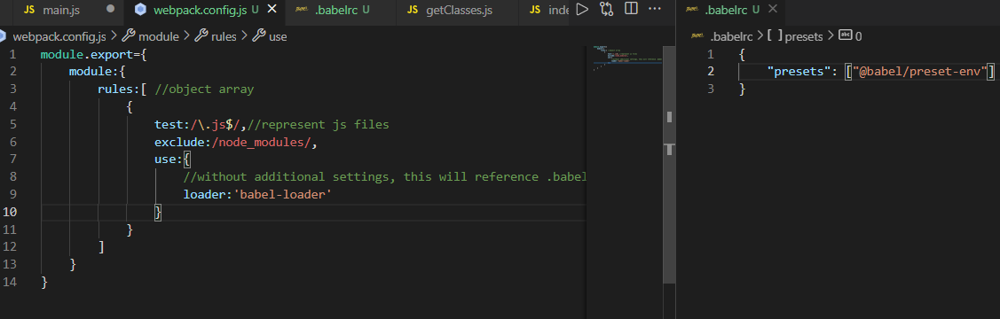
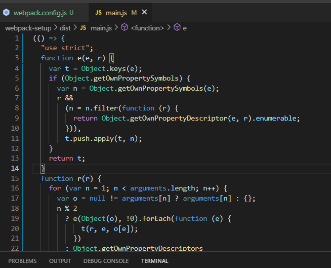
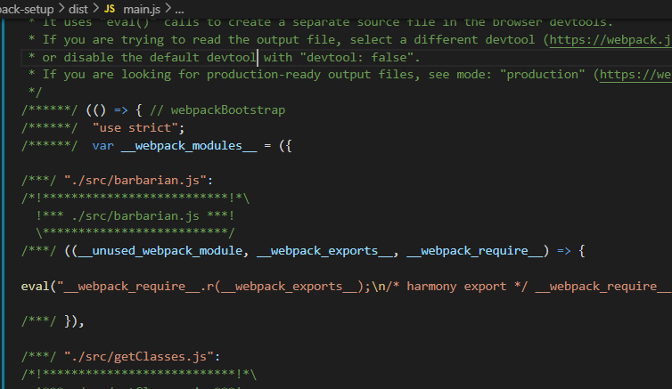
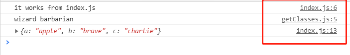
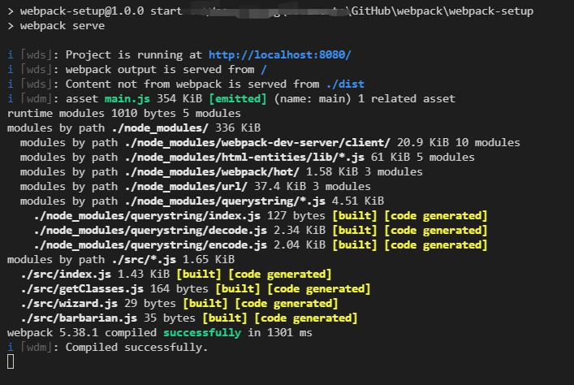
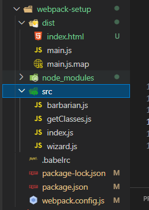
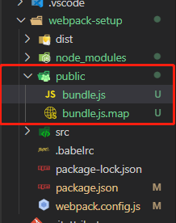
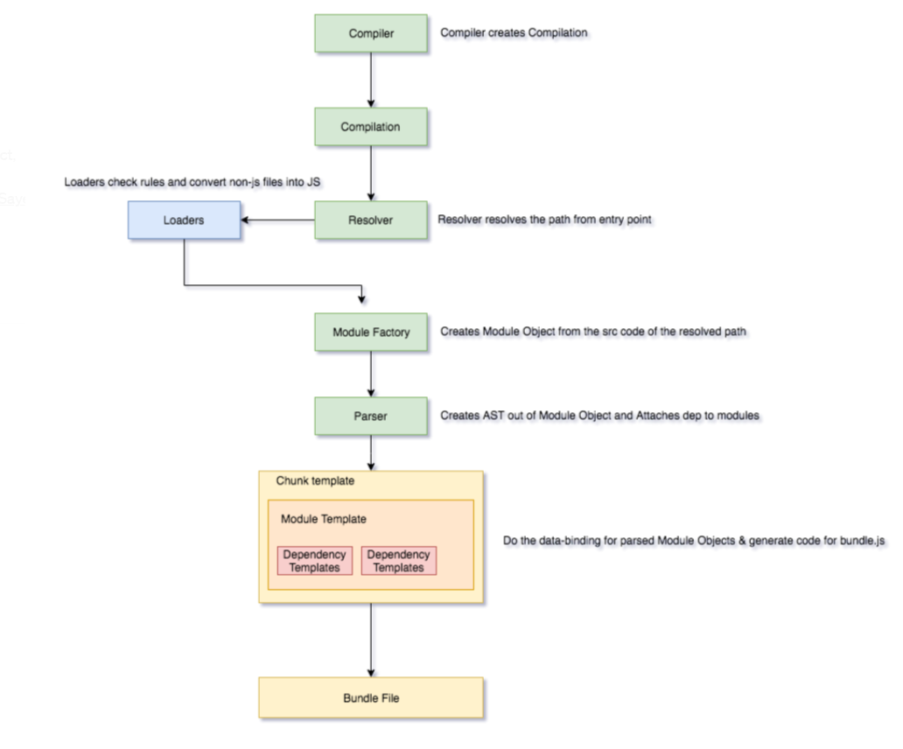
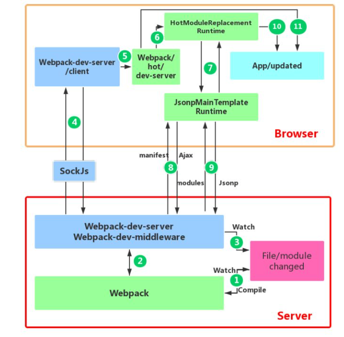

> 这里先声明一下~~ 深入浅出webpack其实已经很老的了。但是用来看原理的东西还是不错的，一定要结合最新的官方文档！！！！
>
> 他的优化以及实战部分~ 我就跳过了 有兴趣的同学自行搜索吧

# webpack的基础动手了解

## 通过基本操作了解webpack

个人觉得 这个小哥讲的很清晰 [参考Creating and Understanding a Basic Webpack 5 Setup](https://www.youtube.com/watch?v=X1nxTjVDYdQ)

> 代码 放在 github/webpack中的 webpack-setup

### part1 - 初步架构

创建文件中带有index.js index.html

通过`npm init -y`，文件夹会自动生成package.json


 ### part2- 尝试引用module变量

这里我们如果创建新的变量在一个js文件，并且在index.js引用时，会报错哦~

此时文件夹目录


> 这里需要了解一下模块化的内容，建议阅读【professional js中模块化章节】。
>
> 那么如果这里按照原先的模块化，那么就需要给他进行额外配置。
>
> 所以这时候，webpack就登场了

### part3 - using webpack to bundle js files

通过`npm i -D webpack webpack-cli`安装webpack，这里node module文件就有啦

然后实际上，要真的做的，就只是设置正确的文件路径

所以我们创建 src文件夹


然后运行`npx webpack`


此时就会创建webpack的执行之后的结果在dist文件中


这时候我们可以看到main.js 实际上已经将**code集合过来**，直接弄出结果

此时 我们再改变一下index.html的引用，那么我们就可以得到网页版的运行结果


**看这里的结果，是不是都来自于main.js 对不对！！ 理解了吧~~ **

 ### part4 example fo minimal output under the hood

这里我们主要是做一个测试（如果我们是否方程呢，那么main.js还是很简单的直接显示结果吗？）

这里我们创建getClasses文件，将其他的两个文件内容放进来。

然后我们对于package.json设置build（主要是为了省事~）


然后 main.js其实实际还是一样的哦~


### part5 Babel transpilling through webpack config file

首先要安装基本的loader `npm i @babel/core @babel/preset-env babel-loader`

preset-env 是为了基本的最新浏览器需要的

接下来我们设置两个文件（新建）



这里告诉webpack， 你现在运行时，要把所有js文件（除了node modules）都进行babel的一个转换。而这里babel loader遵循的是 preset-env的先行标准进行转换。

这里我们在index.js中使用babel会进行转换的

```js
//checking babel support
const obj = {a:'apple', b:'brave'}
const newObj= {...obj,c:'charlie'}
console.log(newObj)
```

然后执行`npm run build`，代码运行没问题，然后我们看看他的结果文件~



这里的主要的意义是看到了babel的转换(多出的部分，就是为了transpiling)

###  part6 switch mode between development and production mode

直接设置mode

```json
module.exports = {
    mode: 'development',
    //mode: 'production', 
    //devtool: 'eval-source-map',
    module:{
        rules:[ 
            //object array
            {
                //represent js files
                test: /\.js$/,
                exclude: /node_modules/,
                use: {
                    //without additional settings, this will reference .babelrc
                    loader:'babel-loader'
                }
            }
        ]
    }
}
```



With this script we instruct webpack to work in **development mode**, convenient for working locally.

### part7  source map for debugging

其实就是加上`devtool: 'source-map',`



这里看到代码的原本位置~~~

[Webpack 5 Full Project Setup](https://www.youtube.com/watch?v=TOb1c39m64A)

### part  8 watch mode

这里主要是监控变化，不用反复编译

实际就是在package.json 里面编写 `"build": "webpack --watch"`

### part 9 dev server for hot reloading on sav 

这里一般由于我用的是vscode 所以直接安装了一个live server。 但是实际上webpack本身也有一个server安装，方便运行的组件~ 配置起来

1. 设置devServer 在webpack.config.js中

```js
   devServer:{
       contentBase:'./dist'
   },
```

2. 直接运行`npm i -D webpack-dev-server`

3. 在package.json中设置

```json
 "scripts": {
   "start": "webpack serve",//增加这个
   "test": "echo \"Error: no test specified\" && exit 1",
   "build": "webpack --watch"
 },
```

4. 运行npm start

   

这里就是运行成功了。

测试： js文件中增加内容，页面会自动刷新（不用手动更新）

> 如果运行不成功 注意文件路径 dist里面是html 以及main.js文件
>
> 

### part10 custom entry and output path

先指定文件的custom路径

```js
    entry: './src/index.js',
    output:{
        filenmae:'bundle.js',
        path: path.resolve(__dirname,'public') //because of different operating system,no hard coding
    },
```

注意由于我们改变了文件output文件，所以server dev运行的时候的路径也要改变哦

```js
    devServer:{
        //contentBase:'./dist'
        contentBase:'./public'//for part 10 custom output location
    },
```

这里运行出来



### part 11 dynamically set development or production 

在package.json 中添加`"build": "NODE_ENV=production webpack"`(之前这里设置的是watch)

在webpack.config.js 中添加`const mode = process.env.NODE_ENV ==='production'? 'production': 'development'`

同时为了保持watch 设置` "build-dev":"webpack --watch"`

这里运行的时候，要么npm run build or npm run build-dev

这里就是两种mode

# 通过Webpack 5 Full Project Setup学习


来源： [Webpack 5 Full Project Setup](https://www.youtube.com/watch?v=TOb1c39m64A&t=166s) 

# webpack 重点部分理解

> 主要是重新学习了《深入浅出Webpack》，所以内容多出自这本书

因为 Webpack 是以模块化的 JavaScript 文件为入口，所以内置了对模块化 JavaScript 的解析功能，支持 AMD、CommonJS、SystemJS、ES6。

## webpack 核心原理/概念

- **Entry**：入口，Webpack 执行构建的第一步将从 Entry 开始，可抽象成输入。
- **Module**：模块，在 Webpack 里一切皆模块，一个模块对应着一个文件。Webpack 会从配置的 Entry 开始递归找出所有依赖的模块。
- **Chunk**：代码块，一个 Chunk 由多个模块组合而成，用于代码合并与分割。
- **Loader**：模块转换器，用于把模块原内容按照需求转换成新内容。
- **Plugin**：扩展插件，在 Webpack 构建流程中的特定时机注入扩展逻辑来改变构建结果或做你想要的事情。
- **Output**：输出结果，在 Webpack 经过一系列处理并得出最终想要的代码后输出结果。



> [图片来源](https://imranhsayed.medium.com/webpack-behind-the-scenes-85333a23c0f6)

1. 初始化：启动构建，读取与合并配置参数，加载 Plugin，实例化 Compiler。
2. 编译：从 Entry 发出，针对每个 Module 串行调用对应的 Loader 去翻译文件内容，再找到该 Module 依赖的 Module，递归地进行编译处理。
3. 输出：对编译后的 Module 组合成 Chunk，把 Chunk 转换成文件，输出到文件系统。

> 以上来源于 深入浅出Webpack

## [工作原理分析](https://webpack.wuhaolin.cn/5%E5%8E%9F%E7%90%86/5-1%E5%B7%A5%E4%BD%9C%E5%8E%9F%E7%90%86%E6%A6%82%E6%8B%AC.html)

> 注意结合上面的图

### 初始化阶段

| 事件名          | 解释                                                         |
| --------------- | ------------------------------------------------------------ |
| 初始化参数      | 从配置文件和 Shell 语句中读取与合并参数，得出最终的参数。 这个过程中还会执行配置文件中的插件实例化语句 `new Plugin()`。 |
| 实例化 Compiler | 用上一步得到的参数初始化 Compiler 实例，Compiler 负责文件监听和启动编译。Compiler 实例中包含了完整的 Webpack 配置，全局只有一个 Compiler 实例。 |
| 加载插件        | 依次调用插件的 apply 方法，让插件可以监听后续的所有事件节点。同时给插件传入 compiler 实例的引用，以方便插件通过 compiler 调用 Webpack 提供的 API。 |
| environment     | 开始应用 Node.js 风格的文件系统到 compiler 对象，以方便后续的文件寻找和读取。 |
| entry-option    | 读取配置的 Entrys，为每个 Entry 实例化一个对应的 EntryPlugin，为后面该 Entry 的递归解析工作做准备。 |
| after-plugins   | 调用完所有内置的和配置的插件的 apply 方法。                  |
| after-resolvers | 根据配置初始化完 resolver，resolver 负责在文件系统中寻找指定路径的文件。 |

### 编译阶段

| 事件名        | 解释                                                         |
| ------------- | ------------------------------------------------------------ |
| run           | 启动一次新的编译。                                           |
| watch-run     | 和 run 类似，区别在于它是在监听模式下启动的编译，在这个事件中可以获取到是哪些文件发生了变化导致重新启动一次新的编译。 |
| compile       | 该事件是为了告诉插件一次新的编译将要启动，同时会给插件带上 compiler 对象。 |
| compilation   | 当 Webpack 以开发模式运行时，每当检测到文件变化，一次新的 Compilation 将被创建。一个 Compilation 对象包含了当前的模块资源、编译生成资源、变化的文件等。Compilation 对象也提供了很多事件回调供插件做扩展。 |
| make          | 一个新的 Compilation 创建完毕，即将从 Entry 开始读取文件，根据文件类型和配置的 Loader 对文件进行编译，编译完后再找出该文件依赖的文件，递归的编译和解析。 |
| after-compile | 一次 Compilation 执行完成。                                  |
| invalid       | 当遇到文件不存在、文件编译错误等异常时会触发该事件，该事件不会导致 Webpack 退出。 |

在编译阶段中，最重要的要数 compilation 事件了，因为在 compilation 阶段调用了 Loader 完成了每个模块的转换操作，在 compilation 阶段又包括很多小的事件，它们分别是：

| 事件名               | 解释                                                         |
| -------------------- | ------------------------------------------------------------ |
| build-module         | 使用对应的 Loader 去转换一个模块。                           |
| normal-module-loader | 在用 Loader 对一个模块转换完后，使用 acorn 解析转换后的内容，输出对应的抽象语法树（AST），以方便 Webpack 后面对代码的分析。 |
| program              | 从配置的入口模块开始，分析其 AST，当遇到 `require` 等导入其它模块语句时，便将其加入到依赖的模块列表，同时对新找出的依赖模块递归分析，最终搞清所有模块的依赖关系。 |
| seal                 | 所有模块及其依赖的模块都通过 Loader 转换完成后，根据依赖关系开始生成 Chunk。 |

### 输出阶段

| 事件名      | 解释                                                         |
| ----------- | ------------------------------------------------------------ |
| should-emit | 所有需要输出的文件已经生成好，询问插件哪些文件需要输出，哪些不需要。 |
| emit        | 确定好要输出哪些文件后，执行文件输出，可以在这里获取和修改输出内容。 |
| after-emit  | 文件输出完毕。                                               |
| done        | 成功完成一次完成的编译和输出流程。                           |
| failed      | 如果在编译和输出流程中遇到异常导致 Webpack 退出时，就会直接跳转到本步骤，插件可以在本事件中获取到具体的错误原因。 |

在输出阶段已经得到了各个模块经过转换后的结果和其依赖关系，并且把相关模块组合在一起形成一个个 Chunk。 在输出阶段会根据 Chunk 的类型，使用对应的模版生成最终要要输出的文件内容。

## loader

### 原理（与plugin 区别）

**`Loader` 本质就是一个函数**，在该函数中对接收到的内容进行转换，返回转换后的结果。 因为 **Webpack 只认识 JavaScript，所以 Loader 就成了翻译官**，对其他类型的资源进行转译的预处理工作。

`Plugin` 就是插件，基于事件流框架 `Tapable`，**插件可以扩展 Webpack 的功能**，在 Webpack 运行的生命周期中会广播出许多事件，Plugin 可以监听这些事件，在合适的时机通过 Webpack 提供的 API 改变输出结果。

`Loader` 在 module.rules 中配置，作为模块的解析规则，类型为数组。每一项都是一个 Object，内部包含了 test(类型文件)、loader、options (参数)等属性。

`Plugin` 在 plugins 中单独配置，类型为数组，每一项是一个 Plugin 的实例，参数都通过构造函数传入。

### 实际使用


比如像这里，loader本身的作用是在于让 webpack 能够去处理那些非 JS 的文件，比如样式文件、图片文件(webpack 自身只理解JS)

第一个babel 主要为了兼容性 以及不同版本之间的js进行一个转换（注意presets 以及pollyfills 的应用）

第二个对于css而言， 这里首先有两个loader，根据规则，这里是**从后往前的**，也就是css文件先传递给了css-loader ，变成js style array。 然后这些在传递给style loader， 这里将得到了array 放入 js modules & bundle files。

所以 假设我们这里是less文件的话，那么就要改变设置，如下了

```js
rules: [
          {
              test: /\.less$/,
              use: ["style-loader", "css-loader", "less-loader"]
          }
  ]
 },
```

> **Hot module replacement**
>
> ```json
> "scripts": {
> "webpack-dev-server": "webpack-dev-server",
>    "dev": "webpack-dev-server --mode=development --hot",
>    "prod": "webpack --mode=production"
>  },
> ```

## 配置（config 中配置）

(这里我根据《深入浅出webpack》书本的章节记录重点 以及一些个人笔记)

### Mode

```js
string = 'production': 'none' | 'development' | 'production'
```

在**开发环境**中，我们需要：强大的 source map 和一个有着 live reloading(实时重新加载) 或 hot module replacement(热模块替换) 能力的 localhost server。

而**生产环境**目标则转移至其他方面，关注点在于压缩 bundle、更轻量的 source map、资源优化等，通过这些优化方式改善加载时间

- development 
  - Tooling for in browser debugging **(source map)**
  - Fast incremental compilation for a fast development cycle
  - Useful **error messages** at runtime
- production
  - **Small output size**
  - Fast code at runtime
  - Omitting **development-only code**
  - Not exposing source code or file paths
  - Easy to use output assets

### [Entry(**必填的**)](https://webpack.wuhaolin.cn/2%E9%85%8D%E7%BD%AE/2-1Entry.html)

`entry`是配置模块的入口，可抽象成输入，Webpack 执行构建的第一步将从入口开始搜寻及递归解析出所有入口依赖的模块。 

entry 与 chunk 是相关的，由于chunk的生成会以Entry配置为标准

> - 如果 `entry` 是一个 `string` 或 `array`，就只会生成一个 Chunk，这时 Chunk 的名称是 `main`；
> - 如果 `entry` 是一个 `object`，就可能会出现多个 Chunk，这时 Chunk 的名称是 `object` 键值对里键的名称。

动态配置Entry（来源于书）

```js
// 同步函数
entry: () => {
  return {
    a:'./pages/a',
    b:'./pages/b',
  }
};
// 异步函数
entry: () => {
  return new Promise((resolve)=>{
    resolve({
       a:'./pages/a',
       b:'./pages/b',
    });
  });
};
```

### [Output](https://webpack.wuhaolin.cn/2%E9%85%8D%E7%BD%AE/2-2Output.html)

`output.filename` 配置输出文件的名称，为string 类型。 如果只有一个输出文件，则可以把它写成静态不变的：

```js
filename: 'bundle.js'
```

但是在有多个 Chunk 要输出时，就需要借助模版和变量了。前面说到 Webpack 会为每个 Chunk取一个名称，可以根据 Chunk 的名称来区分输出的文件名：

```js
filename: '[name].js'
```

```json
// 官方output 的内容解释
output: {
    // options related to how webpack emits results
    path:path.resolve(__dirname, "dist"), // string (default)
    // the target directory for all output files
    // must be an absolute path (use the Node.js path module)
    filename: "[name].js", // string (default)
    // the filename template for entry chunks
    publicPath: "/assets/", // string
    // the url to the output directory resolved relative to the HTML page
    library: { // There is also an old syntax for this available (click to show)
      type: "umd", // universal module definition
      // the type of the exported library
      name: "MyLibrary", // string | string[]
      // the name of the exported library

      /* Advanced output.library configuration (click to show) */
    },
```

### [Module 中 Loader](https://webpack.wuhaolin.cn/2%E9%85%8D%E7%BD%AE/2-3Module.html)

对于module设置 ，[官方链接在此](https://webpack.js.org/configuration/module/)

1. 条件匹配：通过 `test` 、 `include` 、 `exclude` 三个配置项来命中 Loader 要应用规则的文件。
2. 应用规则：对选中后的文件通过 `use` 配置项来应用 Loader，可以只应用一个 Loader 或者按照从后往前的顺序应用一组 Loader，同时还可以分别给 Loader 传入参数。
3. 重置顺序：一组 Loader 的执行顺序默认是从右到左执行，通过 `enforce` 选项可以让其中一个 Loader 的执行顺序放到最前或者最后。

> 这里其实有parser设置， 主要是对于不同文件内容，parser可以精确到语法层面， 而 `noParse` 只能控制哪些文件不被解析

常见loader： image-loader babel-loader ts-loader sass-loader css loader style-loader 

### [Resolve](https://webpack.wuhaolin.cn/2%E9%85%8D%E7%BD%AE/2-4Resolve.html)

Webpack 在启动后会从配置的入口模块出发找出所有依赖的模块，Resolve 配置 Webpack 如何寻找模块所对应的文件。

#### alias

`resolve.alias` 配置项通过别名来把原导入路径映射成一个新的导入路径。例如使用以下配置

```js
// Webpack alias 配置
resolve:{
  alias:{
    components: './src/components/'
  }
}
```

当你通过 `import Button from 'components/button'` 导入时，实际上被 `alias` 等价替换成了 `import Button from './src/components/button'`。

以上 alias 配置的含义是把导入语句里的 `components` 关键字替换成 `./src/components/`。

#### mainFields

有一些第三方模块会针对不同环境提供几分代码。 例如分别提供采用 ES5 和 ES6 的2份代码，这2份代码的位置写在 `package.json` 文件里

#### extensions

在导入语句没带文件后缀时，Webpack 会自动带上后缀后去尝试访问文件是否存在。 `resolve.extensions` 用于配置在尝试过程中用到的后缀列表

#### [modules](https://webpack.js.org/concepts/modules/#what-is-a-webpack-module)

`resolve.modules` 配置 Webpack 去哪些目录下寻找第三方模块，默认是只会去 `node_modules` 目录下寻找。 有时你的项目里会有一些模块会大量被其它模块依赖和导入，由于其它模块的位置分布不定，针对不同的文件都要去计算被导入模块文件的相对路径， 这个路径有时候会很长，就像这样 `import '../../../components/button'` 这时你可以利用 `modules` 配置项优化，

### Plugin

Plugin 用于扩展 Webpack 功能，各种各样的 Plugin 几乎让 Webpack 可以做任何构建相关的事情。

Plugin 的配置很简单，`plugins` 配置项接受一个**数组**，数组里每一项都是一个要使用的 Plugin 的实例，Plugin 需要的参数通过构造函数传入。

```js
const CommonsChunkPlugin = require('webpack/lib/optimize/CommonsChunkPlugin');

module.exports = {
  plugins: [
    // 所有页面都会用到的公共代码提取到 common 代码块中
    new CommonsChunkPlugin({
      name: 'common',
      chunks: ['a', 'b']
    }),
  ]
};
```

**使用 Plugin 的难点在于掌握 Plugin 本身提供的配置项，而不是如何在 Webpack 中接入 Plugin。**

**几乎所有 Webpack 无法直接实现的功能都能在社区找到开源的 Plugin 去解决，你需要善于使用搜索引擎去寻找解决问题的方法。**

常用plugin ： 

- `uglifyjs-webpack-plugin`：不支持 ES6 压缩 (Webpack4 以前)
- `terser-webpack-plugin`: 支持压缩 ES6 (Webpack4)
- `ModuleConcatenationPlugin`: 开启 Scope Hoisting
- **`size-plugin`：监控资源体积变化，尽早发现问题**
- `html-webpack-plugin`：简化 HTML 文件创建 (依赖于 html-loader)
- `web-webpack-plugin`：可方便地为单页应用输出 HTML，比 html-webpack-plugin 好用
- **`HotModuleReplacementPlugin`：模块热替换**  

### [DeServer](https://webpack.wuhaolin.cn/2%E9%85%8D%E7%BD%AE/2-6DevServer.html)

#### [Difference in 'webpack --watch'  vs 'webpack --hot ' vs 'deserver'?](https://stackoverflow.com/questions/38089785/webpack-watch-vs-hot-whats-the-difference)

> `--watch` means : watch for the file changes and compile again when the source files changes.（这里注意还是要手动刷新的哦 原理：轮询判断文件的最后编辑时间是否变化，如果某个文件发生了变化，并不会立刻告诉监听者，而是先缓存起来，等 `aggregateTimeout` 后再执行。）
>
> `--hot` (hot reload) means : don't reload the full page after the source changes, just reload the part which is changed. （HotModuleReplacementPlugin）
>
> The dev server uses webpack’s watch mode. It also prevents webpack from emitting the resulting files to disk. Instead it keeps and serves the resulting files from memory.

### [其它配置项](https://webpack.wuhaolin.cn/2%E9%85%8D%E7%BD%AE/2-7%E5%85%B6%E5%AE%83%E9%85%8D%E7%BD%AE%E9%A1%B9.html)

### 整体配置自测

```json
const path = require('path');

module.exports = {
  // entry 表示 入口，Webpack 执行构建的第一步将从 Entry 开始，可抽象成输入。
  // 类型可以是 string | object | array   
  entry: './app/entry', // 只有1个入口，入口只有1个文件
  entry: ['./app/entry1', './app/entry2'], // 只有1个入口，入口有2个文件
  entry: { // 有2个入口
    a: './app/entry-a',
    b: ['./app/entry-b1', './app/entry-b2']
  },

  // 如何输出结果：在 Webpack 经过一系列处理后，如何输出最终想要的代码。
  output: {
    // 输出文件存放的目录，必须是 string 类型的绝对路径。
    path: path.resolve(__dirname, 'dist'),

    // 输出文件的名称
    filename: 'bundle.js', // 完整的名称
    filename: '[name].js', // 当配置了多个 entry 时，通过名称模版为不同的 entry 生成不同的文件名称
    filename: '[chunkhash].js', // 根据文件内容 hash 值生成文件名称，用于浏览器长时间缓存文件

    // 发布到线上的所有资源的 URL 前缀，string 类型
    publicPath: '/assets/', // 放到指定目录下
    publicPath: '', // 放到根目录下
    publicPath: 'https://cdn.example.com/', // 放到 CDN 上去

    // 导出库的名称，string 类型
    // 不填它时，默认输出格式是匿名的立即执行函数
    library: 'MyLibrary',

    // 导出库的类型，枚举类型，默认是 var
    // 可以是 umd | umd2 | commonjs2 | commonjs | amd | this | var | assign | window | global | jsonp ，
    libraryTarget: 'umd', 

    // 是否包含有用的文件路径信息到生成的代码里去，boolean 类型
    pathinfo: true, 

    // 附加 Chunk 的文件名称
    chunkFilename: '[id].js',
    chunkFilename: '[chunkhash].js',

    // JSONP 异步加载资源时的回调函数名称，需要和服务端搭配使用
    jsonpFunction: 'myWebpackJsonp',

    // 生成的 Source Map 文件名称
    sourceMapFilename: '[file].map',

    // 浏览器开发者工具里显示的源码模块名称
    devtoolModuleFilenameTemplate: 'webpack:///[resource-path]',

    // 异步加载跨域的资源时使用的方式
    crossOriginLoading: 'use-credentials',
    crossOriginLoading: 'anonymous',
    crossOriginLoading: false,
  },

  // 配置模块相关
  module: {
    rules: [ // 配置 Loader
      {  
        test: /\.jsx?$/, // 正则匹配命中要使用 Loader 的文件
        include: [ // 只会命中这里面的文件
          path.resolve(__dirname, 'app')
        ],
        exclude: [ // 忽略这里面的文件
          path.resolve(__dirname, 'app/demo-files')
        ],
        use: [ // 使用那些 Loader，有先后次序，从后往前执行
          'style-loader', // 直接使用 Loader 的名称
          {
            loader: 'css-loader',      
            options: { // 给 html-loader 传一些参数
            }
          }
        ]
      },
    ],
    noParse: [ // 不用解析和处理的模块
      /special-library\.js$/  // 用正则匹配
    ],
  },

  // 配置插件
  plugins: [
  ],

  // 配置寻找模块的规则
  resolve: { 
    modules: [ // 寻找模块的根目录，array 类型，默认以 node_modules 为根目录
      'node_modules',
      path.resolve(__dirname, 'app')
    ],
    extensions: ['.js', '.json', '.jsx', '.css'], // 模块的后缀名
    alias: { // 模块别名配置，用于映射模块
       // 把 'module' 映射 'new-module'，同样的 'module/path/file' 也会被映射成 'new-module/path/file'
      'module': 'new-module',
      // 使用结尾符号 $ 后，把 'only-module' 映射成 'new-module'，
      // 但是不像上面的，'module/path/file' 不会被映射成 'new-module/path/file'
      'only-module$': 'new-module', 
    },
    alias: [ // alias 还支持使用数组来更详细的配置
      {
        name: 'module', // 老的模块
        alias: 'new-module', // 新的模块
        // 是否是只映射模块，如果是 true 只有 'module' 会被映射，如果是 false 'module/inner/path' 也会被映射
        onlyModule: true, 
      }
    ],
    symlinks: true, // 是否跟随文件软链接去搜寻模块的路径
    descriptionFiles: ['package.json'], // 模块的描述文件
    mainFields: ['main'], // 模块的描述文件里的描述入口的文件的字段名称
    enforceExtension: false, // 是否强制导入语句必须要写明文件后缀
  },

  // 输出文件性能检查配置
  performance: { 
    hints: 'warning', // 有性能问题时输出警告
    hints: 'error', // 有性能问题时输出错误
    hints: false, // 关闭性能检查
    maxAssetSize: 200000, // 最大文件大小 (单位 bytes)
    maxEntrypointSize: 400000, // 最大入口文件大小 (单位 bytes)
    assetFilter: function(assetFilename) { // 过滤要检查的文件
      return assetFilename.endsWith('.css') || assetFilename.endsWith('.js');
    }
  },

  devtool: 'source-map', // 配置 source-map 类型

  context: __dirname, // Webpack 使用的根目录，string 类型必须是绝对路径

  // 配置输出代码的运行环境
  target: 'web', // 浏览器，默认
  target: 'webworker', // WebWorker
  target: 'node', // Node.js，使用 `require` 语句加载 Chunk 代码
  target: 'async-node', // Node.js，异步加载 Chunk 代码
  target: 'node-webkit', // nw.js
  target: 'electron-main', // electron, 主线程
  target: 'electron-renderer', // electron, 渲染线程

  externals: { // 使用来自 JavaScript 运行环境提供的全局变量
    jquery: 'jQuery'
  },

  stats: { // 控制台输出日志控制
    assets: true,
    colors: true,
    errors: true,
    errorDetails: true,
    hash: true,
  },

  devServer: { // DevServer 相关的配置
    proxy: { // 代理到后端服务接口
      '/api': 'http://localhost:3000'
    },
    contentBase: path.join(__dirname, 'public'), // 配置 DevServer HTTP 服务器的文件根目录
    compress: true, // 是否开启 gzip 压缩
    historyApiFallback: true, // 是否开发 HTML5 History API 网页
    hot: true, // 是否开启模块热替换功能
    https: false, // 是否开启 HTTPS 模式
    },

    profile: true, // 是否捕捉 Webpack 构建的性能信息，用于分析什么原因导致构建性能不佳

    cache: false, // 是否启用缓存提升构建速度

    watch: true, // 是否开始
    watchOptions: { // 监听模式选项
    // 不监听的文件或文件夹，支持正则匹配。默认为空
    ignored: /node_modules/,
    // 监听到变化发生后会等300ms再去执行动作，防止文件更新太快导致重新编译频率太高
    // 默认为300ms 
    aggregateTimeout: 300,
    // 判断文件是否发生变化是不停的去询问系统指定文件有没有变化，默认每隔1000毫秒询问一次
    poll: 1000
  },
}
```

## webpack原理理解（webpack 怎么写的）

### Entry Ouput 

Entry 就只是制定了入口文件地址

Output 这里要好好的理解一下，不仅仅是一个路径的指向
> 重点是要理解下面的问题
>
> 1. Webpack 输出的 `bundle.js` 是什么样子的吗？ 
> 2. 为什么原来一个个的模块文件被合并成了一个单独的文件？
> 3. 为什么 `bundle.js` 能直接运行在浏览器中？

[详细版的解释 来源于《深入浅出Webpack》](https://webpack.wuhaolin.cn/5%E5%8E%9F%E7%90%86/5-1%E5%B7%A5%E4%BD%9C%E5%8E%9F%E7%90%86%E6%A6%82%E6%8B%AC.html)

1. bundle.js 主要是一个理解执行函数

```js
(function(modules) {
  // 模拟 require 语句
  function __webpack_require__() {
  }

  // 执行存放所有模块数组中的第0个模块
  __webpack_require__(0);
})([/*存放所有模块的数组*/])
```

2. 为什么可以合并成一个文件，理解这个必须就要知道bundle.js 里面的结构（这里详细的代码结构看书本哈）

   **在于浏览器不能像 Node.js 那样快速地去本地加载一个个模块文件，而必须通过网络请求去加载还未得到的文件。 如果模块数量很多，加载时间会很长，因此把所有模块都存放在了数组中，执行一次网络加载**。（这个是比较白话文，下面的通过代码结构来）

   - 首先最外部是一个立即执行函数（即为启动函数）
   - 然后 就要处理modules( 这里现在内存找module缓存 -> 没有缓存的module，安装配置index并加入缓存，引入结果 -> 有缓存的 直接加载 并且引入结果)
   - 再然后是对于加载分割出去的异步代码（由于所有的模块都在一个数组里面，所以会通过_webpack_require 根据模块的index来区分以及定位模块）

3. `bundle.js` 能直接运行在浏览器中的原因

   - 在于输出的文件中通过 `__webpack_require__` 函数定义了一个可以在浏览器中执行的加载函数来模拟 Node.js 中的 `require` 语句。

### [Loader 原理](https://webpack.wuhaolin.cn/5%E5%8E%9F%E7%90%86/5-3%E7%BC%96%E5%86%99Loader.html)

[官方链接](https://webpack.js.org/concepts/loaders/) [编写loader 官方指南](https://webpack.js.org/contribute/writing-a-loader/)

这里不要跟loader 的配置的运行过程混淆！ 这里讲的是loader自身怎么实现的

**由于 Webpack 是运行在 Node.js 之上的，一个 Loader 其实就是一个 Node.js 模块，这个模块需要导出一个函数**。 这个导出的函数的工作就是获得处理前的原内容，对原内容执行处理后，返回处理后的内容。

一个最简单的 Loader 的源码如下：

```js
module.exports = function(source) {
  // source 为 compiler 传递给 Loader 的一个文件的原内容
  // 该函数需要返回处理后的内容，这里简单起见，直接把原内容返回了，相当于该 Loader 没有做任何转换
  return source;
};
```

由于 Loader 运行在 Node.js 中，你可以调用任何 Node.js 自带的 API，或者安装第三方模块进行调用：

```js
const sass = require('node-sass');
module.exports = function(source) {
  return sass(source);
};
```

对于 loader中的option 以及返回其他结果

```js
const loaderUtils = require('loader-utils');
module.exports = function(source) {

 // 获取到用户给当前 Loader 传入的 options 这里就直接return source
 const options = loaderUtils.getOptions(this);
    
// 通过 this.callback 告诉 Webpack 返回的结果
this.callback(null, source, sourceMaps);
// 当你使用 this.callback 返回内容时，该 Loader 必须返回 undefined，
// 以让 Webpack 知道该 Loader 返回的结果在 this.callback 中，而不是 return 中 
  return;
};
```

Loader 有同步和异步之分。但在需要**通过网络请求才能得出结果**，如果采用同步的方式网络请求就会阻塞整个构建，导致构建非常缓慢。

```js
module.exports = function(source) {
    // 告诉 Webpack 本次转换是异步的，Loader 会在 callback 中回调结果
    var callback = this.async();
    someAsyncOperation(source, function(err, result, sourceMaps, ast) {
        // 通过 callback 返回异步执行后的结果
        callback(err, result, sourceMaps, ast);
    });
};
```

> 编写loader 特点/要求
>
> - Keep them **simple**.
> - Utilize **chaining**.
> - Emit **modular** output.
> - Make sure they're **stateless**.
> - Employ **loader utilities**.
> - Mark **loader dependencies**.
> - Resolve **module dependencies**.
> - Extract **common code**.
> - Avoid **absolute paths**.
> - Use **peer dependencies**

### [plugin原理](https://webpack.wuhaolin.cn/5%E5%8E%9F%E7%90%86/5-4%E7%BC%96%E5%86%99Plugin.html)

这个问题看[官方文档](https://webpack.js.org/concepts/plugins/)最明了，或者可以看[深入浅出](https://webpack.wuhaolin.cn/5%E5%8E%9F%E7%90%86/5-4%E7%BC%96%E5%86%99Plugin.html)。自己总结一下就是：

- **使用类来编写，必须实现一个apply方法**；如果是方法实现，需要在其prototype 上定义一个 apply 方法。

```js
class webpackPlugin {
　　constructor(){
　　　　console.log('插件被使用了')
　　}
　　apply(compiler) {
　　// compiler 很重要，是webpack的一个实例，这个实例存储了webpack各种信息，所有打包信息
　　}
}
module.exports = webpackPlugin;
```

- 我们的逻辑是在apply中实现

目前是用两种实现api，一种是 **compiler.plugin('done'…)**；一种是 **compiler.hooks.done**。后者是新的api，目前使用较多。

- 定义 compiler hook 在生命周期中使用

- 操作 webpack 内部实例特定数据。

- 在功能完成后调用 webpack 提供的回调。

- config的时候

```js
plugins: [
  new webpack.ProgressPlugin(),
  new HtmlWebpackPlugin({ template: './src/index.html' }),
]
```

## 面试题收集

### 文件监听原理呢？--watch

[详细的讲解-- 深入浅出webpack](https://webpack.wuhaolin.cn/4%E4%BC%98%E5%8C%96/4-5%E4%BD%BF%E7%94%A8%E8%87%AA%E5%8A%A8%E5%88%B7%E6%96%B0.html)

在发现源码发生变化时，自动重新构建出新的输出文件。

Webpack开启监听模式，有两种方式：

- 启动 webpack 命令时，带上 --watch 参数
- 在配置 webpack.config.js 中设置 watch:true

缺点：每次需要手动刷新浏览器

原理：轮询判断文件的最后编辑时间是否变化，如果某个文件发生了变化，并不会立刻告诉监听者，而是先缓存起来，等 `aggregateTimeout` 后再执行。

```json
module.export = {
    // 默认false,也就是不开启
    watch: true,
    // 只有开启监听模式时，watchOptions才有意义
    watchOptions: {
        // 默认为空，不监听的文件或者文件夹，支持正则匹配
        ignored: /node_modules/,
        // 监听到变化发生后会等300ms再去执行，默认300ms
        aggregateTimeout:300,
        // 判断文件是否发生变化是通过不停询问系统指定文件有没有变化实现的，默认每秒问1000次
        poll:1000
    }
}
```

### webpack的执行逻辑是什么

说句实在的，我面试的这几家公司，包括美团、阿里、头条等大厂，我觉得他们的面试官都不是特别的熟悉这套流程。

- 解析shell和config

- config合并和插件加载，生成一个options对象

- 开始编译和构建流程

- new 一个 compiler，调用compiler.run() 构建一个 Compilation对象，拥有超多的fun。两个作用：

  1、负责组织整个打包过程，包含了每个构建环节和输出环节所对应的方法，如 addEntry() , _addModuleChain() , buildModule() , seal() , createChunkAssets() (在每一个节点都会触发 webpack 事件去调用各插件)。

  2、二是该对象内部存放着所有 module ，chunk，生成的 asset 以及用来生成最后打包文件的 template 的信息。

- 调用addEntry开始构建

  1、调用各loader处理模块之间的依赖，对每一个 require() 用对应的 loader 进行加工，最后生成一个 js module

  2、调用AST解析器将loader处理后的源文件生成抽象语法树

  3、遍历AST，构建改模块所依赖的模块。依赖模块会按照上述方法递归处理

- 所有的模块及其依赖项build之后，调用各插件对构建的结果进行封装，对每一个module和chunk进行整理。生成编译后的源码。 这是我们在开发时进行代码优化和功能添加的关键环节。

- 生成最终assets

  1、模块封装在这一步，判断是入口js还是异步加载的js，调用不同的模板对象进行封装（入口js renderChunkModules）(异步加载的 js 会调用 chunkTemplate 中的 render 方法)。

  2、模块封装，module.source()

  3、生成assets

- 输出 按照 output 中的配置项将文件输出到了对应的 path 中，从而 webpack 整个打包过程结束。

### 如何使用webpack项目优化

这个完全是实战经验，并且每个公司或者项目根据使用场景不同，优化的手段也是不同的。但是大致就是几个方向。

- css的优化，

  1. 使用 mini-css-extract-plugin 来做文件合并
  2. 使用postcss-loader、autoprefixer来帮我们自动补齐浏览器前缀等
  3. css压缩

- js的优化：

  1. 抽取公共代码 SplitChunksPlugin，这个在webpack4以后可以直接在 optimization 中配置。
  2. 懒加载，这个可以自己实现一个，或者是使用现有的库。

- noParse

  在使用类似于jq库的时候，我们不需要webpack再去构建其内部依赖关系，这时候我们可以手动干预。在module中 noParse: /jquery/

- DLLPlugin
  dll是一个很好的优化手段，可以极大的提升我们的编译速度。让我们每次只编译业务代码，类似于React、Redux等我们不更改的包，只打包一次就可以。 DLL的使用需要自己写一丢丢代码，也很简单，具体看官方文档。

### [文件指纹策略](https://juejin.cn/post/6875511103716229133)

### [开启模块热替换](https://webpack.wuhaolin.cn/4%E4%BC%98%E5%8C%96/4-5%E4%BD%BF%E7%94%A8%E8%87%AA%E5%8A%A8%E5%88%B7%E6%96%B0.html)(Hot Module Replacement)

[深度解析热更新](https://zhuanlan.zhihu.com/p/30669007)

基本实现原理大致这样的，构建 bundle 的时候，加入一段 HMR runtime 的 js 和一段和服务沟通的 js 。文件修改会触发 webpack 重新构建，服务器通过向浏览器发送更新消息，浏览器通过 jsonp 拉取更新的模块文件，jsonp 回调触发模块热替换逻辑。

**整个 HMR 的工作流程**

- 第一步：webpack 对文件系统进行 watch 打包到内存中
- 第二步：devServer 通知浏览器端文件发生改变
- 第三步：webpack-dev-server/client 接收到服务端消息做出响应
- 第四步：webpack 接收到最新 hash 值验证并请求模块代码
- 第五步：HotModuleReplacement.runtime 对模块进行热更新
- 第六步：业务代码中， index.js 文件中调用 HMR 的 accept 方法，添加模块更新后的处理函数



>  [深度解析热更新 图来源](https://zhuanlan.zhihu.com/p/30669007)

### [Tree shaking （Dead code elimination）](https://webpack.docschina.org/guides/tree-shaking/)

tree shaking 依赖于 ES2015 模块语法的 [静态结构](http://exploringjs.com/es6/ch_modules.html#static-module-structure) 特性, 从通过 `package.json` 的 `"sideEffects"` 属性作为标记，向 compiler 提供提示，表明项目中的哪些文件是 "pure(纯正 ES2015 模块)"，由此可以安全地删除文件中未使用的部分。

**原理是**

- `ES6 Module`引入进行静态分析，故而编译的时候正确判断到底加载了那些模块
- 静态分析程序流，判断那些模块和变量未被使用或者引用，进而删除对应代码（在package.json中开启`"sideEffects": false`来告知 webpack 它可以安全地删除未用到的 export）

**sideEffects**决定代码是否导入。比如`console.log()`、 `polyfills`、`import a CSS file`等。由于编译器并不知道其是否会影响运行效果，故而不做处理。

```json
 // package.json
//false:无副作用，模块无export被使用时，可直接跳过（删除）该模块
 //true:有副作用，保留副作用代码
 "sideEffects": [Boolean], 
 or
 //[file1,file2]:指定有副作用的文件，在webpack作用域提升时就不会引入
 //accepts relative, absolute, and glob patterns to the relevant files
  "sideEffects": ['*.css', 'src/tool.js'],
```

1）treeShaking可以删除未被导出使用的代码，而sideEffects决定了副作用的处理方式，可以进一步提高有效代码的纯粹度；

2）__webpack_require__.d用的很巧妙，工具方法的抽象，复用性；

3）另外模块化是服务于人的，方便维护；对机器来说，代码放在一起，少了链接加载过程，执行会更快。

> 这里很容易问道关于模块化的问题~~~ 看模块化的复习部分哦

### 结合模块化的理解

其实根据官方的文档， 我联想output 这个写法的里面的webpack_require 中