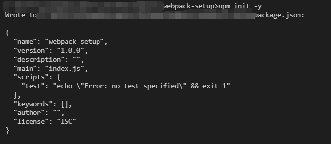
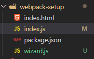
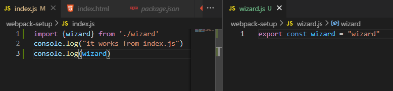
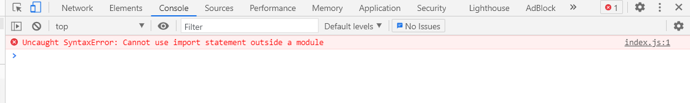
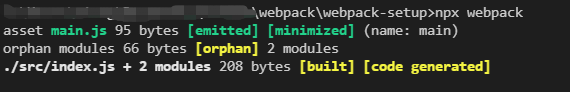
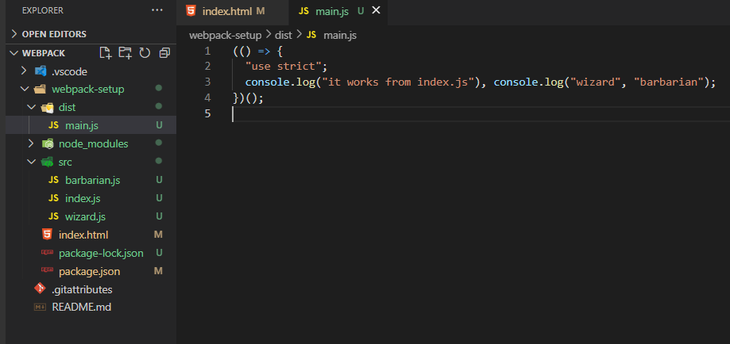
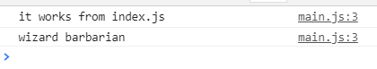
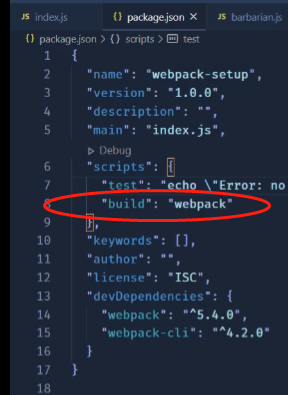
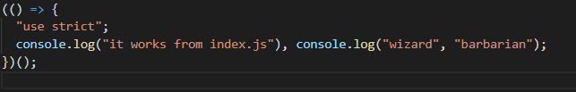

# webpack的基础动手了解

## 通过基本操作了解webpack

个人觉得 这个小哥讲的很清晰 [参考Creating and Understanding a Basic Webpack 5 Setup](https://www.youtube.com/watch?v=X1nxTjVDYdQ)

### part1 - 初步架构

创建文件中带有index.js index.html

通过`npm init -y`，文件夹会自动生成package.json



 ### part2- 尝试引用module变量

这里我们如果创建新的变量在一个js文件，并且在index.js引用时，会报错哦~

此时文件夹目录







> 这里需要了解一下模块化的内容，建议阅读【professional js中模块化章节】。
>
> 那么如果这里按照原先的模块化，那么就需要给他进行额外配置。
>
> 所以这时候，webpack就登场了

### part3 - using webpack to bundle js files

通过`npm i -D webpack webpack-cli`安装webpack，这里node module文件就有啦

然后实际上，要真的做的，就只是设置正确的文件路径

所以我们创建 src文件夹


然后运行`npx webpack`



此时就会创建webpack的执行之后的结果在dist文件中



这时候我们可以看到main.js 实际上已经将**code集合过来**，直接弄出结果

此时 我们再改变一下index.html的引用，那么我们就可以得到网页版的运行结果



**看这里的结果，是不是都来自于main.js 对不对！！ 理解了吧~~ **

 ### part4 example fo minimal output under the hood

这里我们主要是做一个测试（如果我们是否方程呢，那么main.js还是很简单的直接显示结果吗？）

这里我们创建getClasses文件，将其他的两个文件内容放进来。

然后我们对于package.json设置build（主要是为了省事~）



然后 main.js其实实际还是一样的哦~




[Webpack 5 Full Project Setup](https://www.youtube.com/watch?v=TOb1c39m64A)


# webpack 重点部分理解

## webpack 核心原理

## loader


比如像这里，loader本身的作用是在于让 webpack 能够去处理那些非 JS 的文件，比如样式文件、图片文件(webpack 自身只理解JS)

第一个babel 主要为了兼容性 以及不同版本之间的js进行一个转换（注意presets 以及pollyfills 的应用）

第二个对于css而言， 这里首先有两个loader，根据规则，这里是**从后往前的**，也就是css文件先传递给了css-loader ，变成js style array。 然后这些在传递给style loader， 这里将得到了array 放入 js modules & bundle files。

所以 假设我们这里是less文件的话，那么就要改变设置，如下了

```js
rules: [
          {
              test: /\.less$/,
              use: ["style-loader", "css-loader", "less-loader"]
          }
  ]
 },
```

> **Hot module replacement**
>
> ```json
> "scripts": {
> "webpack-dev-server": "webpack-dev-server",
>    "dev": "webpack-dev-server --mode=development --hot",
>    "prod": "webpack --mode=production"
>  },
> ```

