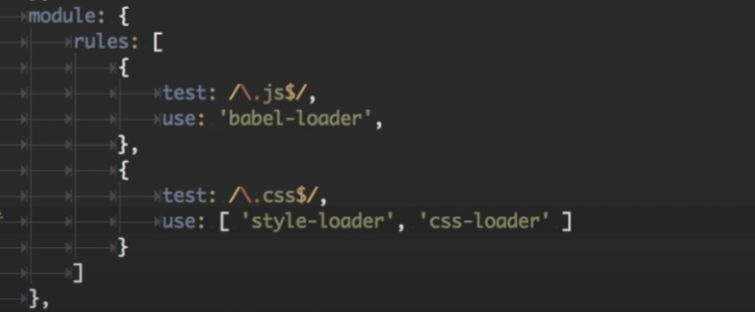

## webpack的整体了解

个人觉得 这个小哥讲的很清晰 [参考Creating and Understanding a Basic Webpack 5 Setup](https://www.youtube.com/watch?v=X1nxTjVDYdQ)

 [Webpack 5 Full Project Setup](https://www.youtube.com/watch?v=TOb1c39m64A)

## webpack 核心原理

## loader



比如像这里，loader本身的作用是在于让 webpack 能够去处理那些非 JS 的文件，比如样式文件、图片文件(webpack 自身只理解JS)

第一个babel 主要为了兼容性 以及不同版本之间的js进行一个转换（注意presets 以及pollyfills 的应用）

第二个对于css而言， 这里首先有两个loader，根据规则，这里是**从后往前的**，也就是css文件先传递给了css-loader ，变成js style array。 然后这些在传递给style loader， 这里将得到了array 放入 js modules & bundle files。

所以 假设我们这里是less文件的话，那么就要改变设置，如下了

```js
rules: [
          {
              test: /\.less$/,
              use: ["style-loader", "css-loader", "less-loader"]
          }
  ]
 },
```

> **Hot module replacement**
>
> ```js
> "scripts": {
> "webpack-dev-server": "webpack-dev-server",
>    "dev": "webpack-dev-server --mode=development --hot",
>    "prod": "webpack --mode=production"
>  },
> ```