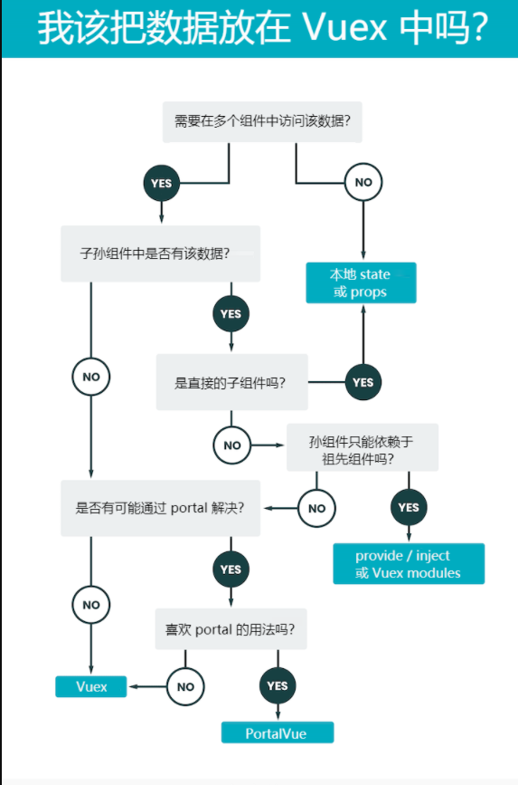

前面把Vue基础介绍完了, 只是写Vuex的练习的时候突然思考到一个问题
**怎么判断什么时候将数据给Vuex中store呢?**

##  把数据存入 Vuex 的理由

那么把数据存入一个集中式的 Vuex store 中有哪些理由呢？

###  数据对多个（独立的）组件来说必须是可访问的

### 集中式的 API / 数据获取逻辑

###  客户端的持久化应用状态

感谢 [vuex-persistedstate](https://github.com/robinvdvleuten/vuex-persistedstate) 这样的 Vue.js 插件，在浏览器中用 Vuex 管理持久化状态变得非常容易了。这使得处理用户保持离线这样的复杂状况变得简单

##  不把数据存入 Vuex 的理由

### 复杂性

### 维护成本

## 如果不用store,除了基础传值的方法

下面的细节[请看](https://juejin.cn/post/6844903840114966536#heading-11)

### 从 API / Apollo 获取数据

###  portals

## **重点图**

## Reference

[[译] 一张图弄明白 Vuex 里该存放什么样的数据](https://juejin.cn/post/6844903840114966536#heading-0)