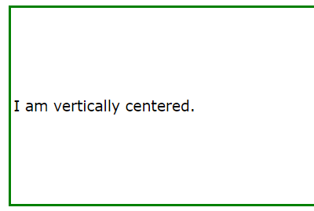
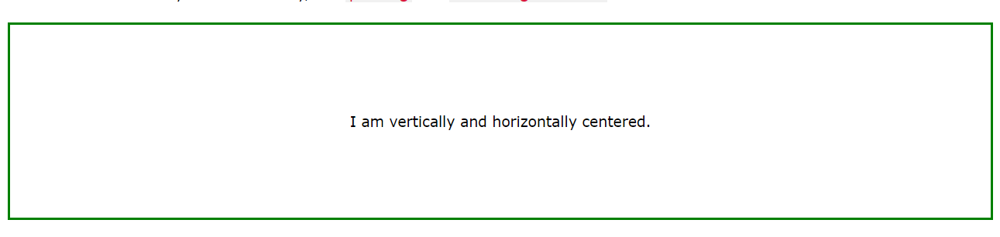

# 纯CSS七大居中方法

1. ### **上下左右定位+margin居中法**

   ```
   父元素：position: relative;
   
   子元素：position: absolute; left: 0; right: 0; top: 0; bottom: 0; margin: auto;
   ```

   

2. ### **50%定位+margin居中法**

   ```
   父元素：position: relative;
   
   子元素：position: absolute; left: 50%; top: 50%; margin: -200px 0 0 -200px;
   ```

   注：200px须为该子元素的宽高的一半。例如该子元素宽为100px，高为50px，那么margin取值为-25px 0 0 -50px。该方法缺点是须确定子元素宽高。

3. ### **table-cell居中法**

   ```
   父元素：display: table-cell; text-align: center; vertical-align: middle;
   
   子元素：display: inline-block;
   ```

   

4. ### **50%定位+translate居中法**

   ```
   父元素：position: relative;
   
   子元素：position: absolute; left: 50%; top: 50%; transform: translate(-50%,-50%);
   ```

5. ### **Flexbox+margin居中法**

   ```
   父元素：display: flex;
   
   子元素：margin: auto;
   ```

6. ### **Flexbox居中法**

   ```
   父元素：display: flex; justify-content: center; align-items: center;
   ```

   注：该方法使用了Flexbox弹性布局，移动端兼容性也存在很大问题。

7. ### **line-height居中法**

   ```
   父元素：text-align: center; line-height:600px; font-size: 0;
   
   子元素：display: inline-block; vertical-align: middle;
   ```

   注：600px必须为父元素的高度，这里还需注意的一点是font-size需设为零，若未写该属性将导致元素并不能精确垂直居中。该方法即为我面试时所答的方法，缺点很明显，父元素高度须确定。

8. **对于图片以及文字居中，  

   - ​	Center Vertically

     ```html
     <style>
     .center {
       padding: 70px 0;//缺点：要知道父级的宽度
       border: 3px solid green;
     }
     </style>
     </head>
     <body>
     
     <div class="center">
       <p>I am vertically centered.</p>
     </div>
     ```

     

   - center both vertically and horizontally

     ```css
     .center {
       padding: 70px 0;
       border: 3px solid green;
       text-align: center;
     }
     ```

     或者

     ```css
     .center {
       line-height: 200px;
       height: 200px;
       border: 3px solid green;
       text-align: center;
     }
     
     /* If the text has multiple lines, add the following: */
     .center p {
       line-height: 1.5;
       display: inline-block;
       vertical-align: middle;
     }
     ```

     

     

Reference:

1. https://developer.aliyun.com/article/635759?spm=a2c6h.14164896.0.0.54cf667ajTM2fR
2. https://developer.aliyun.com/article/591138?spm=a2c6h.14164896.0.0.54cf667ajTM2fR
3. https://www.w3schools.com/css/css_align.asp