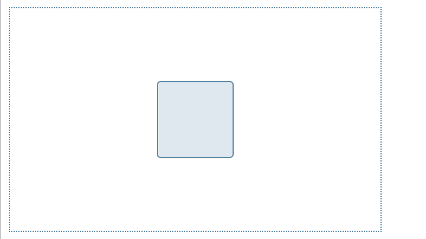
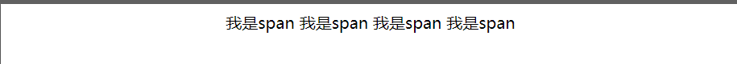
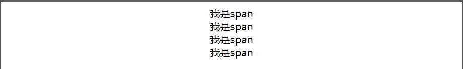
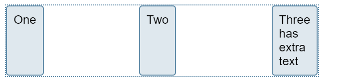
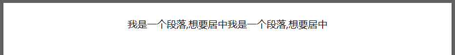

# 纯CSS七大居中方法

### 1.上下左右定位+margin居中法

```css
父元素：position: relative;

子元素：position: absolute; left: 0; right: 0; top: 0; bottom: 0; margin: 0 auto;
//或者
子元素： margin-left: auto; margin-right: auto; display：block；
```


### 2.50%定位+margin居中法 （通过子元素设置relative + 负margin）

```
父元素：position: relative;

子元素：position: absolute; left: 50%; top: 50%; margin: -200px 0 0 -200px;
```

注：200px须为该子元素的宽高的一半。例如该子元素宽为100px，高为50px，那么margin取值为-25px 0 0 -50px。该方法缺点是须确定子元素宽高。

### 3.table-cell居中法

```
父元素：display: table-cell; text-align: center; vertical-align: middle;

子元素：display: inline-block;
```


### 4.50%定位+translate居中法（此方法很好用）

```
父元素：position: relative;

子元素：position: absolute; left: 50%; top: 50%; transform: translate(-50%,-50%);
```

### 5.Flexbox+margin居中法（此方法很好用）

```
父元素：display: flex;

子元素：margin: auto;
```

6.Flexbox居中法

```
父元素：display: flex; justify-content: center; align-items: center;
```

注：该方法使用了Flexbox弹性布局，移动端兼容性也存在很大问题。

### 7.text-align居中法

```
父元素：text-align: center; line-height:600px; font-size: 0;

子元素：display: inline-block; vertical-align: middle;
```

### 8.利用flex全页面居中



```css
.box {
  display: flex;
  align-items: center;/*Vertical Centering*/
  justify-content: center;
     /* align-self: center;  want specific flex items to be centered vertically*/
}

.box div {
  width: 100px;
  height: 100px;
}
<div class="box">
  <div></div>
</div>
      
```


### 9.对于图片以及文字居中  - 对于行元素  

#### Center horizontally

```html
<style>
  div {
   display:block;
   text-align: center;
   }
  span {
    text-align: center;
    }
</style>
<div>
    <span>我是span</span>
    <span>我是span</span>
    <span>我是span</span>
    <span>我是span</span>
</div>
```



或者其父元素(必须是块级元素)设置如下CSS样式

```css
div {  text-align: center;   }
```

对于多个子元素，排列为中间 - 设置元素自身display: block属性和text-align:center属性

```css
span {
           display: block;
           text-align: center;
       }
```





#### Center Vertically

```html
<style>
.center {
position: relative;
top: 50%;
transform: translateY(-50%);
}
</style> 
<div class="center">
  <p>I am vertically centered.</p>
</div>
```


#### center both vertically and horizontally

```css
.center {
  padding: 70px 0;
  border: 3px solid green;
  text-align: center; //父级要求居中
}
```

或者

```css
.center {
  line-height: 200px;
  height: 200px;
  border: 3px solid green;
  text-align: center;//父级要求居中
}

/* If the text has multiple lines, add the following: */
.center p {
  line-height: 1.5;
  display: inline-block; //子级显示
  vertical-align: middle;//纵向
}
```


### 10.对于有多个div状态的保留块元素的排版，父元素居中

```css
//父元素
position: absolute;
    left: 50%;
    transform: translate(-50%,50%);
```


或者是（这种的话 多个div不好弄 代码很累赘）



```html
 .box {
            display: flex;
            justify-content: space-between;
          }
   <div class="box">
      <div>One</div>
      <div>Two</div>
      <div>Three
          <br>has
          <br>extra
          <br>text
      </div>
    </div>

```


# 根据元素选择方式

## (1)元素为行内元素时 

- 给其父元素(必须是块级元素)设置 text-align: center;

- 元素自身display: block属性和text-align:center属性也能达到水平居中的效果

  例子-centering horizontally 上面的1

  

## (2)元素为块级元素时

- 该块级元素设置如下代码 margin: 0 auto - 上面的2
- 思路:先将子元素设置为块级表格来显示（类似），再将其设置水平居中.  **display:table和margin**

- ```html
  <style>
        p{ display: table;
            margin: 0 auto;
            background-color: orangered; }
     </style>
     <div class="div">
         <p>我是一个段落,想要居中</p>
     </div>
  ```

- **absolute+transform** - 上面的4
- **flex+justify-content** 上面的6

## (3)多个块级元素时

- 多个块级元素时
- 利用inline-block

```html
<style>
        .div { text-align: center; }
        p{ display: inline-block; }
    </style>
    <div class="div">
        <p class="p1">我是一个段落,想要居中</p>
        <p class="p2">我是一个段落,想要居中</p>
        <p class="p3">我是一个段落,想要居中</p>
    </div>
```

## (4)浮动元素水平居中 (父absolute/relative)

- **宽度不固定的浮动元素**

- - 父元素和子元素同时左浮动，然后父元素相对左移动50%;
  - 再然后子元素相对右移动50%，或者子元素相对左移动-50%也就可以了.

```html
<style>
        .div{
            float: left;
             position: absolute;//position:relative;
            left: 50%;
        }
        p{
            float:left;
            position:relative;
            right:50%;
        }
    </style>

<div class="div"> 
    <p>我是一个段落,想要居中</p>
    <p>我是一个段落,想要居中</p>
</div>
```




## (5)绝对定位的元素水平居中对齐

```html
<style>
       .div {
           position: absolute;
           width: 500px;
           height: 300px;
           background: palevioletred;
           margin: 0 auto;
           left: 0;
           right: 0;
       }

       p {
           text-align: center;
       }
   </style>
   <div class="div">
       <p class="p1">我是一个段落,想要居中</p>
       <p class="p2">我是一个段落,想要居中</p>
       <p class="p3">我是一个段落,想要居中</p>
   </div>
```


# other trick：

https://www.digitalocean.com/community/tutorials/css-centering-using-flexbox

https://www.w3.org/Style/Examples/007/center.en.html#text

https://www.w3schools.com/css/css_align.asp 

Reference:

1. https://developer.aliyun.com/article/635759?spm=a2c6h.14164896.0.0.54cf667ajTM2fR
2. https://developer.aliyun.com/article/591138?spm=a2c6h.14164896.0.0.54cf667ajTM2fR
3. https://www.w3schools.com/css/css_align.asp